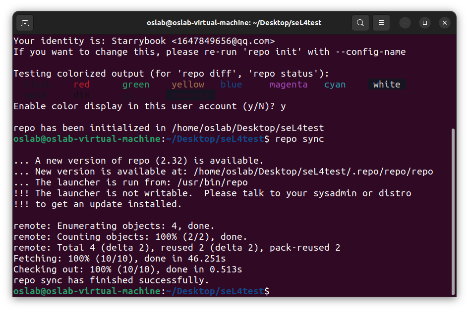
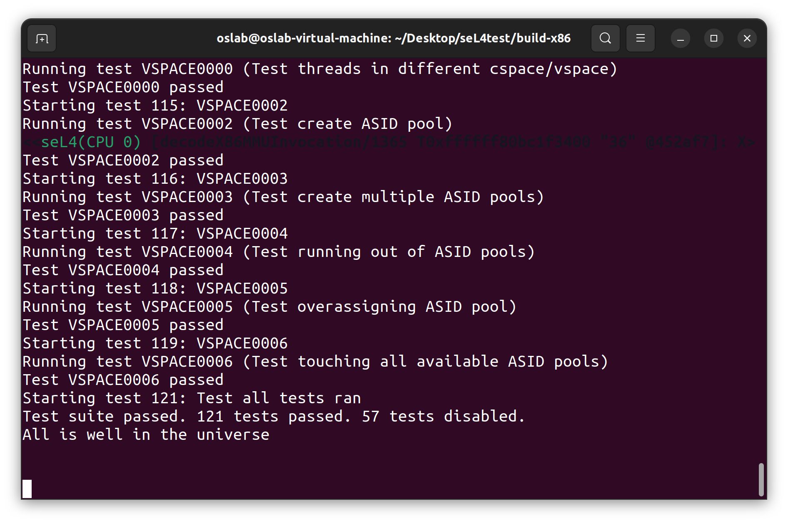

# Feasibility


* 1. [理论依据](#)
	* 1.1. [seL4](#seL4)
	* 1.2. [Rust](#Rust)
* 2. [技术依据](#-1)
	* 2.1. [Rust重写sel4](#Rustsel4)
		* 2.1.1. [rust的技术支持](#rust)
		* 2.1.2. [生态系统](#-1)
		* 2.1.3. [Rust的安全性](#Rust-1)
		* 2.1.4. [Rust的适配性](#Rust-1)
		* 2.1.5. [重写完毕后的测试依据](#-1)
	* 2.2. [调度算法](#-1)
		* 2.2.1. [sel4的实时性](#sel4)
		* 2.2.2. [优化调度算法来提高sel4的实时性](#sel4-1)
	* 2.3. [文件系统](#-1)
		* 2.3.1. [运行用户态程序](#-1)
		* 2.3.2. [虚拟化技术](#-1)
* 3. [创新点](#-1)
* 4. [概要设计报告](#-1)
* 5. [SeL4初步配置与运行](#SeL4)
	* 5.1. [配置情况](#-1)
	* 5.2. [调试工具](#-1)
		* 5.2.1. [sel4 debug lib](#sel4debuglib)
	* 5.3. [测试和评测](#-1)
		* 5.3.1. [主要工具](#-1)
	* 5.4. [目录树分析](#-1)
	* 5.5. [Reference](#Reference)


##  1. <a name=''></a>理论依据

###  1.1. <a name='seL4'></a>seL4

seL4是一款操作系统微内核，是当前第二代微内核中最为出色的一款，其主要优势在于拥有经过了形式化验证的极高安全性，同时并没有为此损失性能，其性能不仅不落后于已有的微内核，还实现了性能的极大提升，使之成为目前最安全、性能最高的微内核，并且开源，有着较好的参考价值。

###  1.2. <a name='Rust'></a>Rust

Rust是一种安全、高性能、并发、可读性强的系统级编程语言。

1. 安全性：Rust通过在编译时进行严格的所有权和借用规则检查，以防止访问未初始化的内存、空指针和数据竞争等常见的程序错误。此外，Rust还具有内置的安全保障，例如内存安全、类型安全和线程安全等。

2. 高性能：Rust的内存管理机制，包括零成本抽象和高度优化的编译器，可以提供与C和C++相媲美的性能。Rust还提供了易于编写高效代码的功能，例如零成本抽象和内联汇编等。

3. 并发性：Rust内置了并发原语，例如锁、信号量和通道等，以及异步编程支持，可以轻松地编写高效的并发代码。

4. 可读性：Rust具有清晰的语法和代码风格，以及灵活的抽象机制，使得代码易于阅读、维护和重构。


##  2. <a name='-1'></a>技术依据
###  2.1. <a name='Rustsel4'></a>Rust重写sel4
####  2.1.1. <a name='rust'></a>rust的技术支持

跨平台、有活跃社区和丰富生态系统

####  2.1.2. <a name='-1'></a>生态系统

Rust的生态系统非常活跃，有大量的开源库和工具可用于各种用途，例如网络编程、图形界面、数据处理和机器学习等。

跨平台：Rust可以在各种平台上运行，包括Linux、Windows、macOS、iOS、Android等。

社区：Rust有一个活跃的社区，拥有众多的贡献者和开发者。社区提供了大量的文档、教程和交流渠道，以帮助新用户学习和使用Rust。

####  2.1.3. <a name='Rust-1'></a>Rust的安全性性
在改写sel4的过程中，Rust的安全性体现在两个方面：

+ 内存安全性：Rust使用所有权系统、借用检查器等特性来保证内存的安全性。在改写sel4时，采用了Rust的语言特性，对代码进行了严格的内存安全检查，避免了系统漏洞的出现。
+ 并发安全性：由于sel4是一个高性能的操作系统内核，需要处理复杂的多任务并发情况，因此Rust的并发安全性显得尤为重要。在改写sel4时，Rust提供了线程安全、数据竞争检查等特性，使得内核能够处理并发任务，同时保障系统的稳定性和安全性。

综上所述，Rust在改写sel4的过程中通过提供内存安全性和并发安全性的特性，保障了sel4的安全性和稳定性，提高了其可信度和可用性。

####  2.1.4. <a name='Rust-1'></a>Rust的适配性性
在Rust中，可以使用Rust提供的ffi（Foreign Function Interface）来调用C语言函数。要调用C函数，需要进行以下步骤：
在Rust中导入libc库，这个库包含了许多C标准库函数的声明。

```
use libc;
```

声明C函数的原型，使用extern "C"关键字来表示这是一个C函数：

```
Rust
extern "C" {
    fn foo(arg1: c_int, arg2: *const c_char) -> c_int;
}
```
在Rust中调用C函数，可以使用unsafe代码块：
```
Rust
unsafe {
    let result = foo(42, b"hello\0".as_ptr() as *const c_char);
    println!("Result: {}", result);
}
```

在这个例子中，我们调用了函数foo，传递了两个参数（一个整数和一个字符串）并打印了返回值并使用了as_ptr()方法将Rust字符串转换为C字符串。需要注意的是，调用C函数时必须使用unsafe代码块，因为C函数可能会修改程序的内存。如果不使用unsafe代码块，编译器将会报错。同时，也需要注意处理类型转换和内存管理，以避免出现安全漏洞。

####  2.1.5. <a name='-1'></a>重写完毕后的测试依据据 
seL4官网上给出了使用qemu进行模拟的内核功能测试方法和测试包。通过替换kernel.elf文件可以对各种内核进行功能测试。
    

###  2.2. <a name='-1'></a>调度算法
####  2.2.1. <a name='sel4'></a>sel4的实时性

seL4本身的设计目的是用于安全和实时系统的微内核操作系统。它本身已经具有一些实时特性，但是可以采取以下措施来进一步增强其实时性能：

+ 实时调度算法：seL4支持多种实时调度算法，包括最高优先级先调度、抢占式和非抢占式调度等。根据应用   程序的需求，可以选择最适合的调度算法以提高实时性能。

+ 实时优先级管理：seL4提供了实时优先级管理机制，可以通过指定优先级来确保实时任务具有最高优先级。   这可以防止低优先级任务占用系统资源并影响实时任务的响应时间。

+ 中断处理：seL4支持中断处理，可以通过注册中断处理函数来实现实时任务的快速响应。可以使用中断优先   级管理机制来确保中断处理程序具有足够的优先级以满足实时要求。

+ 内存管理：seL4的内存管理机制可以通过预留一定量的内存空间来减少内存分配的开销，从而提高实时性 能。

+ 基于时间片的调度：seL4支持基于时间片的调度机制，可以为任务分配固定的时间片并定期进行调度。这可以确保实时任务在规定时间内得到执行。

####  2.2.2. <a name='sel4-1'></a>优化调度算法来提高sel4的实时性

选择最合适的调度算法：seL4支持多种调度算法，包括FIFO、Round Robin、EDF（Earliest Deadline   First）和CBRR（Constant Bandwidth Server Round Robin）等。根据应用程序的实时需求和系统资源的可用性，可以选择最合适的调度算法来提高系统的实时性能。

+ 优化调度器性能：调度器是操作系统的核心组件之一，其性能直接影响系统的实时性能。可以通过优化调度器的  代码来提高其性能，例如采用更高效的数据结构、算法和并发技术等。

+ 基于优先级的调度：seL4支持基于优先级的调度机制，可以为任务分配优先级并根据其优先级进行调度。可以通  过适当地调整任务的优先级来提高实时任务的响应时间。

+ 支持多处理器：seL4可以在多处理器上运行，可以将任务分配给不同的处理器以提高系统的实时性能。

+ 避免不必要的上下文切换：上下文切换是操作系统中的开销之一，可以通过避免不必要的上下文切换来提高实时  性能。例如，可以使用抢占式调度来避免无效的上下文切换。

###  2.3. <a name='-1'></a>文件系统
目前，sel4本身是不具备文件系统的，但是可以通过在sel4中运行用户态程序或者通过虚拟化技术来实现外接文件系统。下面分别介绍一下这两种方式。
####  2.3.1. <a name='-1'></a>运行用户态程序
在sel4中，可以通过运行用户态程序来实现对外接文件系统的访问。开发者可以编写一个或多个用户态程序，这些程序可以通过IPC或其他机制与sel4内核通信，从而实现对外接文件系统的访问。

这种方式需要开发者具有熟练的用户态程序编写能力，并且需要为每个文件系统格式编写相应的用户态程序。虽然这种方式相对比较简单，但是存在风险，因为用户态程序可能会访问系统内的敏感数据和资源，从而对系统安全性造成威胁。

####  2.3.2. <a name='-1'></a>虚拟化技术
另外一种实现外接文件系统访问的方式是通过虚拟化技术来实现。可以在sel4上运行虚拟机，然后在虚拟机中运行带有所需文件系统的操作系统。这种方式可以支持多种文件系统格式，并能确保文件系统和操作系统在虚拟环境中运行，不会对sel4的安全性造成威胁。

需要注意的是，这种方式需要虚拟化技术的支持，因此需要使用支持虚拟化的硬件平台来运行sel4内核。同时，还需要考虑到虚拟化带来的性能损失和额外的开销等问题。

综上，虽然目前sel4本身不具备文件系统，但是可以通过运行用户态程序或者虚拟化技术来实现sel4对外接文件系统的支持和使用。


对于我们认为的微内核发展方向例如嵌入式操作系统、物联网，对安全性、实时性要求较高可以执行以下步骤：

1. 选择一个文件系统实现。有几个选项可用，如FAT、EXT2/3/4和其他选项。
2. 将文件系统实现代码集成到您的seL4构建环境中。您可以将源代码克隆到构建目录中，也可以使用Yocto或Buildroot等包管理器来安装文件系统代码。
3. 修改seL4构建配置，以便在映像中包含文件系统实现,可以通过在Kconfig文件中添加适当的配置选项来实现这一点。
4. 编写一个文件系统驱动程序，实现与文件系统接口所需的系统调用。驱动程序应该处理文件和目录操作以及任何其他必要的功能，如装载和卸载。
5. 构建包含文件系统代码和驱动程序的seL4映像，并将其部署到目标系统。

##  3. <a name='-1'></a>创新点

**微内核的发展方向**

微内核在近几十年来广受研究者和开发者的重视，并且在近些年取得了非常大的发展。据我们调研，微内核未来的一些发展趋势如下：

+ 安全性：面对与日俱增的安全威胁，微内核越来越重视安全功能，利用沙盒、进程隔离等技术，确保系统尽可能安全。sel4是当前唯一通过形式化验证的微内核，从数学上其安全性得到保障。

+ 嵌入式系统：微内核在嵌入式系统中的使用越来越常见，比如在汽车、医疗设备和工业设备中。微内核的体量小、资源需求低、实时性好，非常适合这样的应用场景。

+ 虚拟化：微内核与虚拟化技术结合，允许多个操作系统在同一硬件上运行。这样可以提高灵活性和效率，由于进行了隔离，安全性也得到了提升。

+ 云计算：微内核在云计算环境中使用，以提供轻量级、可扩展且灵活的操作系统。


**我们的改进方向**

针对未来的应用场景，我们认为未来的微内核在具有高性能和小体量的优势下，应具有的重要特性是安全性和实时性。sel4已经具有较好的安全性，通过优化调度算法等方法，我们可以增强sel4的实时性，增强在未来场景的可用性。同时，我们将尝试为其增加文件系统，使其成为一个直接可用的操作系统。

##  4. <a name='-1'></a>概要设计报告
1. Rust重写sel4
    我们主要关注于 src/object 里面内容的重构。此子文件夹涉及 seL4 的核心内容———— Endpoint 端点、调度算法、TCB等。我们认为这些部分是 seL4 的核心，因此我们着重于重构这些核心部分。
    

2. 修改sel4的调度算法
    我们认为 Round Robin 调度算法还有优化的空间，或许我们可以根据不同情景切换调度。我们认为未来微内核在物联网嵌入式场景会得到广泛地应用。而Shortest Deadline Scheduling 可以保证任务完成的及时性。或许灵活切换调度算法可以更有效、高效地完成任务。

3. sel4外接文件算法
        
    我们认为seL4想要在未来得到广泛的应用，那么其需要外接与之配套的文件系统，可以给其他用户程序提供文件接口，能够完成一些简单的文件任务，从而成为一个能独立运行工作的“核”内。而为了保证seL4内核的精简性和安全性，以及工作的复杂性，我们不考虑在seL4源码内添加文件系统，而改用外接的形式。这样可以降低工作量，也符合微内核最初的设计理念。


##  5. <a name='SeL4'></a>SeL4初步配置与运行
###  5.1. <a name='-1'></a>配置情况

> `sel4test`:包含`seL4`的测试套件，用于检查内核及其`api`的功能和正确性。

安装完所需的大量依赖以后，运行

```
repo init -u https://github.com/seL4/sel4test-manifest.git
repo sync
```



这里以`X86`架构为基础测试，在`build-x86`目录内，运行

```
../init-build.sh -DPLATFORM=x86_64 -DSIMULATION=TRUE
ninja
```

> **Ninja**是一个专注于速度的小型[构建系统](https://zh.wikipedia.org/wiki/組建自動化)[[2\]](https://zh.wikipedia.org/wiki/Ninja_(构建系统)#cite_note-2)，[CMake](https://zh.wikipedia.org/wiki/CMake)支持生成Ninja构建文件。

QEMU运行`SeL4test`，可以编译通过并运行，得到`All is well in the universe`。




###  5.2. <a name='-1'></a>调试工具

####  5.2.1. <a name='sel4debuglib'></a>sel4 debug lib

> `sel4 debug lib` is a library that provides some `debugging utilities` for seL4 applications.  It is part of the `seL4_libs project`, which contains a collection of libraries for working on seL4. 

包含了以下功能：

+ 消息信息

    此库提供了一些将消息打印到串行控制台的函数，如printf、puts、vprintf等。这些函数使用共享缓冲区和锁来确保原子性，并避免来自不同线程的消息交叉。可以通过设置一些环境变量(如ZF_LOG_LEVEL和ZF_LOG_TAG)来配置不同冗长级别的消息。

+ 寄存器转储

    此库提供了函数`sel4debug_dump_registers`，打印给定线程的当前寄存器值。当线程发生故障或崩溃时，此函数可用于检查线程的状态。

+ 转储页表

    此库提供了函数`sel4debug_dump_page_tables`，用于打印给定虚拟地址范围的页表项。可用于检查应用程序的虚拟内存布局或调试页面错误。

+ `Cnode`转储

    此库提供了函数`sel4debug_dump_cnode`，打印给定CNode中的功能，可用于检查应用程序的功能空间或调试功能故障。

+ 回溯堆栈帧

    此库提供了函数`sel4debug_backtrace`，打印给定线程的调用堆栈。可以使用宏`SEL4_DEBUG_BACKTRACE`打印当前线程的调用堆栈。

> 不过此库主要是针对操作系统上的应用程序，应用程序通过添加库文件引用的方式可以实现调试功能。至于对于我们的重构工作是否有足够大的帮助还有待进一步的考量。这里主要是作为一个参考。

###  5.3. <a name='-1'></a>测试和评测

相关的项目与检测内核功能与性能的工具：

+ `l4v`:包含seL4规范和证明，正式验证内核的功能正确性、安全性和性能。
+ `sel4test`:包含seL4的测试套件，用于检查内核及其api的功能和正确性。
+ `sel4bench`:包含seL4的微基准测试套件，用于测量内核性能的各个方面。
+ `CAmkES -tool`:包含主要的`CAmkES`工具，它为开发和构建作为交互组件集合的静态seL4系统提供支持。

####  5.3.1. <a name='-1'></a>主要工具

`l4v`提供了理论上的对`SeL4`内核的安全性的证明。但在实际的应用上，我们将

+ 主要通过`sel4test`来检测内核功能的正确性，达到源码编译后测试的水准；
+ 主要通过`sel4bench`来详细测试并分析我们重构的内核在功能的各个方面的表现

> seL4bench是seL4的基准测试应用程序和支持库。它提供了多个应用程序来测量内核性能的各个方面，包括：
>
> + IPC延迟
> + IRQ处理
> + 调度开销
> + 信号传递
> + ......

而我们所主要关注的是：

+ 利用`SeL4`原本的优势，减少IPC延迟，提供高效的信号传递
+ 减少进程调度开销
+ 减少内存调页次数，优化内存管理
+ 如果之后考虑交互密集型的应用场景，则对IRQ也有更高的要求


###  5.4. <a name='-1'></a>目录树分析

> 目前我们初步计划使用`X86`作为架构基础指令集，`RISC-V`作为备选方案。故目录树中架构部分的支持主要保留了与`X86`有关的内容。

简化后的`SeL4`源码目录树大致如下：

```
├───configs
├───include
├───libsel4
│   ├───arch_include
│   │   └───x86
│   ├───include 
│   │   ├───api
│   │   ├───interfaces
│   │   └───sel4
│   ├───mode_include
│   ├───sel4_arch_include
│   │   └───x86_64
│   ├───sel4_plat_include
│   ├───src
│   └───tools
├───src
│   ├───api
│   ├───arch
│   │   └───x86
│   │       ├───64
│   │       │   ├───kernel
│   │       │   ├───machine
│   │       │   ├───model
│   │       │   ├───object
│   │       │   └───smp
│   │       ├───api
│   │       ├───benchmark
│   │       ├───kernel
│   │       ├───machine
│   │       ├───model
│   │       ├───object
│   │       └───smp
│   ├───benchmark
│   ├───config
│   ├───drivers
│   ├───fastpath
│   ├───kernel
│   ├───machine
│   ├───model
│   ├───object
│   ├───plat
│   ├───CMakeFiles
└───.vscode

```

主要文件夹：

+ include：主要包含内核与API的头文件
+ src：包含内核实现的具体代码与ASM源文件
+ manual：包含sel4的参考手册
+ tools：包含一些生成位域和引导映像的工具

> 我们主要需要重写与重构的是`src`文件夹中的内容，重点包括`object`，`fastpath`，也包括`kernel`, `machine`, `model`等。


###  5.5. <a name='Reference'></a>Reference

[Ninja(wikipedia.org)](https://zh.wikipedia.org/wiki/Ninja_(构建系统))

[sel4bench | seL4 docs](https://docs.sel4.systems/projects/sel4bench/)

[Tutorials | seL4 docs](https://docs.sel4.systems/Tutorials/)

[Getting Started | seL4 docs](https://docs.sel4.systems/GettingStarted)
