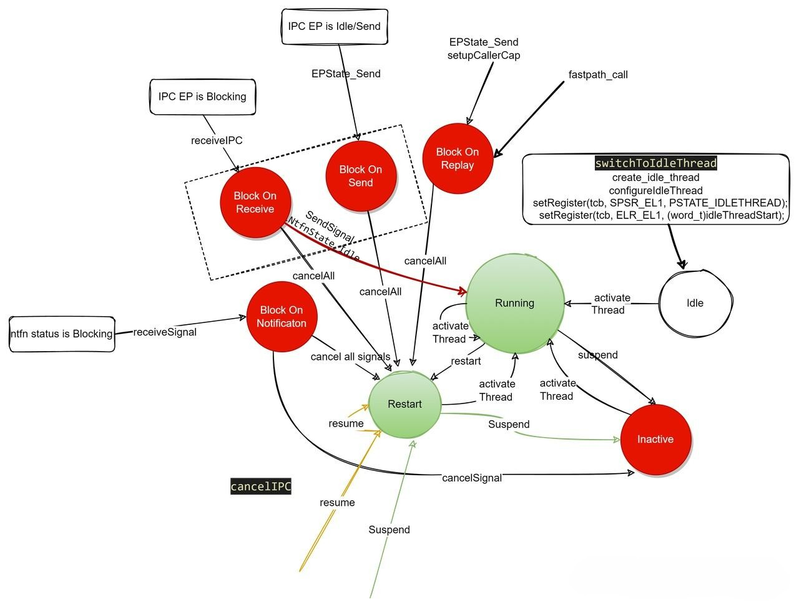
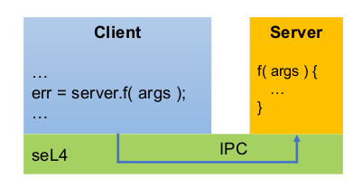
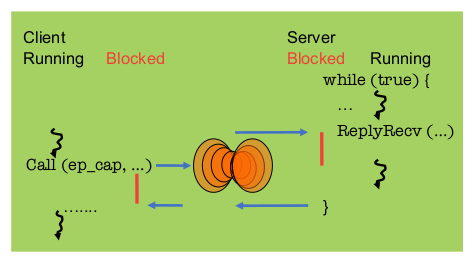
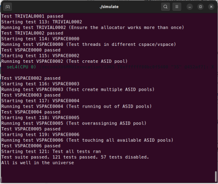

# OSH-2023 Phoenix-Flames 结题报告

## 成员介绍

组长：邓博文 负责了解编译过程并将组员编写的Rust代码链接到C中

组员：晏铭 负责Thread and Exceution相关内容的编写

组员：钟睿智 负责Notification相关内容的编写

组员：蒋文浩 负责Capability Space相关内容的编写

组员：王志成 负责Message Passing相关内容的编写


## 项目简介

我们的项目是用**Rust改写seL4微内核代码**。

seL4是一个高安全性、高性能的操作系统微内核，是L4系列微内核中的一个，由Trustworthy Systems Group于2009年发布，支持主流的ARM、x86和RISC-V架构，现已开源并成立基金会。

Rust 是由 Mozilla 研究室主导开发的一门现代系统编程语言,运行效率与C/C++一个级别，且具有极高的安全性，在保证内存安全和线程安全的同时使编译后的程序运行速度极快。


## 项目背景

### Rust

#### 高性能（Performance）

Rust 速度惊人且内存利用率极高。由于没有运行时和垃圾回收，它能够胜任对性能要求特别高的服务，可以在嵌入式设备上运行，还能轻松和其他语言集成。

##### 可执行文件

Rust是编译语言，这意味着程序直接转换为可执行的机器代码，因此可以将程序作为单个二进制文件进行部署；与 Python 和 Ruby 等解释型语言不同，无需随程序一起分发解释器，大量库和依赖项，这是一大优势。与解释型语言相比，Rust 程序非常快。

##### 对动态类型语言与静态类型的平衡

动态类型语言在调试、运行时具有不确定性，而静态类型的语言减少了程序理解的开销和动态运行的不确定性，但并不是所有静态类型系统都是高效的。Rust使用可选类型对这种可能性进行编码，并且编译器要求你处理`None`这种情况。这样可以防止发生可怕的运行时错误（或等效语言），而可以将其提升为你在用户看到它之前解决的编译时错误。Rust的静态类型尽最大努力避免程序员的麻烦，同时鼓励长期的可维护性。一些静态类型的语言给程序员带来了沉重的负担，要求他们多次重复变量的类型，这阻碍了可读性和重构。其他静态类型的语言允许在全局进行数据类型推断。虽然在最初的开发过程中很方便，但是这会降低编译器在类型不再匹配时提供有用的错误信息的能力。Rust可以从这两种样式中学习，并要求顶层项（如函数参数和常量）具有显式类型，同时允许在函数体内部进行类型推断。

##### 解决垃圾回收问题

Rust可以选择将数据存储在堆栈上还是堆上，并在编译时确定何时不再需要内存并可以对其进行清理。这样可以有效利用内存，并实现更高性能的内存访问。Tilde是Rust在其Skylight产品中的早期生产用户，他发现通过使用Rust重写某些Java HTTP服务，他们能够将内存使用量从5Gb减少到50Mb。无需连续运行垃圾收集器，Rust项目非常适合被其他编程语言通过外部功能接口用作库。这使现有项目可以用快速的Rust代码替换对性能至关重要的代码，而不会产生其他系统编程语言固有的内存安全风险。某些项目甚至已使用这些技术在Rust中进行了增量重写。通过直接访问硬件和内存，Rust是嵌入式和裸机开发的理想语言你您可以编写底层代码，例如操作系统内核或微控制器应用程序。在这些特别具有挑战性的环境中，Rust的核心类型和功能以及可重用的库代码表现将会非常出色。

#### 可靠性（Reliability）

Rust 丰富的类型系统和所有权模型保证了内存安全和线程安全，让您在编译期就能够消除各种各样的错误。

##### 处理系统级编程

与其他系统级编程语言（例如C或C ++）相比，Rust可以提供的最大好处是借阅检查器。这是编译器的一部分，负责确保引用不会超出引用的数据寿命，并有助于消除由于内存不安全而导致的所有类型的错误。与许多现有的系统编程语言不同，Rust不需要你将所有时间都花在细节上。Rust力求拥有尽可能多的*零成本抽象*，这种抽象与等效的手写代码具有同等的性能。当安全的Rust无法表达某些概念时，ref="[http://cliffle.com/p/dangerust/](https://link.zhihu.com/?target=http%3A//cliffle.com/p/dangerust/)">可以使用不安全的 Rust。这样可以释放一些额外的功能，但作为交换，程序员现在有责任确保代码真正安全。然后，可以将这种不安全的代码包装在更高级别的抽象中，以确保抽象的所有使用都是安全的。使用不安全的代码应该是一个经过深思熟虑的决定，因为正确使用它需要与负责避免未定义行为的任何其他语言一样多的思考和关心。最小化不安全代码是最小化由于内存不安全而导致段错误和漏洞的可能性的最佳方法。系统性编程语言有一种天生的使命，即它们必须永远有效地存在。尽管某些现代软件并不需要那么长的使用寿命，但许多企业希望其辛苦编写代码库在可预见的将来能够一直使用。

##### 并发编程更容易

Rust通过防止编译时的数据竞争，使编写并发程序变得更加容易。当来自不同线程的至少两个不同指令尝试同时访问相同的内存位置，而其中至少一个尝试写入某些内容并且没有同步可以在各种访问之间设置任何特定顺序时，就会发生数据争用。未定义对内存的访问而不进行同步。在 Rust 中，检测到数据竞争。如果给定的对象访问不支持许多线程（即没有标记适当的特征），则需要通过互斥锁进行同步，该互斥锁将锁定其他线程对该特定对象的访问。为了确保对对象执行的操作不会破坏它，只有一个线程可以访问它。从其他线程的角度来看，对此对象的操作是原子的，这意味着观察到的对象状态始终是正确的，并且您无法观察到另一个线程对此对象执行的操作导致的任何中间状态。Rust 语言可以检查我们是否对此类对象执行了任何不正确的操作，并在编译时通知我们。

#### 生产力

Rust 拥有出色的文档、友好的编译器和清晰的错误提示信息， 还集成了一流的工具——包管理器和构建工具， 智能地自动补全和类型检验的多编辑器支持， 以及自动格式化代码等等。

##### Cargo包管理器

Rust 由于有 Cargo 这样一个非常出色的包管理工具，周边的第三方库发展非常迅速，各个领域都有比较成熟的库，比如 HTTP 库有 Hyper，异步 IO 库有 Tokio, mio 等，基本上构建后端应用必须的库 Rust 都已经比较齐备。 总体来说，现阶段 Rust 定位的方向还是高性能服务器端程序开发，另外类型系统和语法层面上的创新也使得其可以作为开发 DSL 的利器。

Cargp被公认为 Rust 生态系统的非凡优势之一。如果没有 Cargo，我们将不得不搜索库，从 GitHub 从未知来源下载这些库，构建为静态库箱，将它们链接到程序。这一切是多么痛苦。但是我们有 Cargo 在与 Rust 合作时为我们完成所有这些工作。

### seL4

seL4是世界上**最小的内核之中的一个**，可是seL4的性能能够与当今性能最好的微内核相比。 作为微内核，seL4为应用程序提供少量的服务。如创建和管理虚拟内存地址空间的抽象，线程和进程间通信IPC。这么少的服务靠**8700**行C代码搞定。seL4是高性能的L4微内核家族的新产物，它具有操作系统所必需的服务。如线程，IPC，虚拟内存，中断等。seL4的特性如下所示：

#### 最小化原则

seL4作为一个微内核，为所有系统服务和用户程序提供资源的访问控制、为各个系统组件提供通信，是操作系统的核心部分，具有优先权限。seL4坚持了微内核的“最小化原则”，将大量的硬件驱动和系统服务裁减掉，甚至将内核内存分配和时间片分配丢到用户空间中，以实现微内核的最小化。由此带来的好处是拥有许多的应用场景，为场景中的多种操作系统提供可靠的基础支持。

#### 安全性

L4系列微内核已经是全球最先进、最安全的操作系统内核，而seL4又在其中出类拔萃。seL4是世界上第一个且是迄今为止唯一一个经过安全性形式验证的操作系统。seL4的安全性表现为在它为系统中运行的应用程序之间的隔离提供了最高的保证 ，这意味着可以遏制系统某一部分的妥协，并防止损害该系统其他可能更关键的部分。

#### 性能

正如seL4官网标题下的第一条标语：“Security is no excuse for bad performance（安全性不是降低性能的借口）”，seL4在保障了首屈一指的安全性的同时也兼顾了其性能。seL4的性能较此前的系统内核不仅没有降低，反而得到了增强。一个显著的指标就是其IPC时间较之其他的OS内核减少了至少一半。


## 技术依据

### rust的技术支持

跨平台、有活跃社区和丰富生态系统

### 生态系统

Rust的生态系统非常活跃，有大量的开源库和工具可用于各种用途，例如网络编程、图形界面、数据处理和机器学习等。

跨平台：Rust可以在各种平台上运行，包括Linux、Windows、macOS、iOS、Android等。

社区：Rust有一个活跃的社区，拥有众多的贡献者和开发者。社区提供了大量的文档、教程和交流渠道，以帮助新用户学习和使用Rust。

### Rust的安全性

在改写sel4的过程中，Rust的安全性体现在两个方面：

- 内存安全性：Rust使用所有权系统、借用检查器等特性来保证内存的安全性。在改写sel4时，采用了Rust的语言特性，对代码进行了严格的内存安全检查，避免了系统漏洞的出现。
- 并发安全性：由于sel4是一个高性能的操作系统内核，需要处理复杂的多任务并发情况，因此Rust的并发安全性显得尤为重要。在改写sel4时，Rust提供了线程安全、数据竞争检查等特性，使得内核能够处理并发任务，同时保障系统的稳定性和安全性。

综上所述，Rust在改写sel4的过程中通过提供内存安全性和并发安全性的特性，保障了sel4的安全性和稳定性，提高了其可信度和可用性。

### Rust的适配性

在Rust中，可以使用Rust提供的ffi（Foreign Function Interface）来调用C语言函数。要调用C函数，需要进行以下步骤： 在Rust中导入libc库，这个库包含了许多C标准库函数的声明。

```
use libc;
```


声明C函数的原型，使用extern "C"关键字来表示这是一个C函数：

```Rust
extern "C" {
    fn foo(arg1: c_int, arg2: *const c_char) -> c_int;
```

在Rust中调用C函数，可以使用unsafe代码块：

```Rust
unsafe {
    let result = foo(42, b"hello\0".as_ptr() as *const c_char);
    println!("Result: {}", result);
}
```


在这个例子中，我们调用了函数foo，传递了两个参数（一个整数和一个字符串）并打印了返回值并使用了as_ptr()方法将Rust字符串转换为C字符串。需要注意的是，调用C函数时必须使用unsafe代码块，因为C函数可能会修改程序的内存。如果不使用unsafe代码块，编译器将会报错。同时，也需要注意处理类型转换和内存管理，以避免出现安全漏洞。


### 重写完毕后的测试依据

seL4官网上给出了使用qemu进行模拟的内核功能测试方法和测试包。通过替换kernel.elf文件可以对各种内核进行功能测试。


### seL4的内核机制

#### Capability Space（能力空间）

##### Capability

Capability 是访问系统中一切实体或对象的令牌，这个令牌包含了某些访问权力，只有持有这个令牌，才能按照特定的方式访问系统中的某个对象。
seL4 中将 capability 分做三种：

- 内核对象（如 线程控制块）的访问控制的 capability。

- 抽象资源（如 IRQControl ）的访问控制的 capability 。（中断控制块是干啥的，以后会提到）

- untyped capabilities ，负责内存分配的 capabilities 。seL4 不支持动态内存分配，在内核加载阶段将所有的空闲内存绑定到 untyped capabilities 上，后续的内核对象申请新的内存，都通过系统调用和 untyped caability 来申请。

###### CNode和CSlots

CNode 也是一个对象，但这个对象存的是一个数组，数组里的元素是 capability 。数组中的各个位置我们称为 CSlots ，在上面的例子中， seL4_CapInitThreadTCB 实际上就是一个 CSlot ，这个 CSlot 中存的是控制 TCB 的 capability 。

每个 Slot 有两种状态：

empty：没有存 capability。
full：存了 capability。
出于习惯，0号 Slot 一直为 empty。

一个 CNode 有 1 << CNodeSizeBits 个 Slot，一个 Slot 占 1 << seL4_SlotBits 字节。

###### CSpace

CSpace 是一个 线程 的能力空间，是线程拥有的capability的集合，由一个或多个CNode组成。根进程的CSpace包含所有由seL4拥有资源的capability，在系统启动时被授予。


#### notification

Notification 机制是 seL4 里用于传递信号量的机制，其本质为由信号量组成的一个队列。

线程可以进行 signaling, polling 和 waiting 。

线程也可以和某个 notification 队列绑定，一旦绑定，该 notification 只能被绑定的线程等待以及更改

其定义如下：

```rust
pub struct notification {
    pub words:[u64;4]
}
pub type notification_t=notification;
```

可以看到，其为一个由 4 个无符号 64 位整数组成的队列（数组）。

notification 源码中涉及的函数大致为：获取 notification 队列的某个值、修改某个值，或者根据不同的线程状态设置不同的值，当然，作为信号量，必定有最重要的 send 和 recieve 操作

例如，sendSignal 操作如下所示：

```rust
pub fn sendSignal(ntfnPtr: *mut notification_t, badge: word_t) {
    let tmp:u64 = notification_ptr_get_state(ntfnPtr);
    if tmp == NtfnState_Idle as u64 {
        let mut tcb: *mut tcb_t = notification_ptr_get_ntfnBoundTCB(ntfnPtr) as (*mut tcb_t);
        if tcb!=0 as *mut tcb{
            if unsafe{thread_state_ptr_get_tsType(&mut (*tcb).tcbState) == ThreadState_BlockedOnReceive as u64} {
                cancelIPC(tcb);//from endpoint.c
                unsafe{
                    setThreadState(tcb, ThreadState_Running as u64);//from thread.c
                }
                unsafe{
                    setRegister(tcb, /*badgeRegister*/9, badge);//from thread.c
                    possibleSwitchTo(tcb);//from thread.c
                }
            } else {
                ntfn_set_active(ntfnPtr, badge);
            }
        } else {
            ntfn_set_active(ntfnPtr, badge);
        }
        //break;
    }else
    if tmp == NtfnState_Waiting as u64 {
        let mut nftn_queue: tcb_queue_t = ntfn_ptr_get_queue(ntfnPtr);
        let mut dest: *mut tcb_t = nftn_queue.head;
        //assert(dest) //this is for failure detection
        nftn_queue = tcbEPDequeue(dest, nftn_queue);//from tcb.c
        ntfn_ptr_set_queue(ntfnPtr, nftn_queue);
        if nftn_queue.head == 0 as *mut tcb_t {
            notification_ptr_set_state(ntfnPtr, NtfnState_Idle as u64);
        }
        unsafe{
            setThreadState(dest, ThreadState_Running as u64);
        }
        unsafe{
            setRegister(dest, badgeRegister, badge);
            possibleSwitchTo(dest);
        }
    }else
    if tmp == NtfnState_Active as u64 {
        let badge2:word_t = notification_ptr_get_ntfnMsgIdentifier(ntfnPtr) | badge;
        notification_ptr_set_ntfnMsgIdentifier(ntfnPtr, badge2);
    }
}
```

可以看到，这个函数聚焦于对队列的读取与修改，在整个 notification 源码中亦是如此。

#### Thread

##### 线程是sel4的调度单位

sel4中cpu的调度单位是线程，每个线程在创建时会分配一个TCB，每个TCB都关联⼀个可能与其它线程共享的CSpace和VSpace，可能还有⼀个IPC缓冲区，⽤于在IPC通信或内核对象引⽤时，不能由依赖架构的消息寄存器传递的参数。线程不是必须要有IPC缓冲区，只是这时线程将不能使⽤很多内核调⽤，因为它们需要传递能⼒。每个线程都属于且仅属于⼀个安全域或说调度域。

##### 调度算法

seL4使⽤具有256个优先级(0-255)、抢占的、tickless调度器。所有线程都有⼀个最⼤可控优先级(MCP)和⼀个优先级，后者是线程的有效优先级。当⼀个线程修改另⼀个线程的优先级(包括它⾃⼰)时，它必须提供⼀个线程能⼒，以便从中获取MCP。线程只能将优先级和MCP设置为⼩于或等于提供的线程MCP。线程优先级包含两个值，如下所⽰:
优先级：线程调度所依据的优先级。
最⼤可控优先级(MCP)：线程可以对⾃⼰或别的线程设置的最⾼优先级。

##### 线程状态

sel4的线程大致可以分为五个状态：running、restart、block、inactive、idle

其中block又可细分为：block on receive、block on send、block on replay、block on notification

其状态转换图如下：



#### IPC

指导理念：内核只提供机制,不提供服务。

```
Kernel provides no services, only mechanisms
```

二者之间的相互调用通过IPC完成。

**跨域调用图示**（来自于UNSW的课件）：




**调用过程（握手机制）**：




用户线程调用`call`时进入端点的排队队列，内核为其创建一个回复对象用来传递信息，此线程将阻塞在这个回复对象上直到其完成信息的传递。


**通过裁减过的代码可以体现出握手的大致过程：**

`fastpath_call`：调用方

```rust
/* 
 * 此前进行一系列检查，能力的定义与端点的信息都要符合要求，
 * 只要有不符合要求的地方，都会转入slowpath
 * 检查完毕后，进行IPC的核心部分
 */
// 目标线程出队
endpoint_ptr_set_epQueue_head_np(ep_ptr, (&(*(dest)).tcbEPNext) as word_t);
// 获取回复者的能力插槽
let replySlot: *mut cte_t = 
    ((use_ksCurThread&!1014) as *mut cte_t) + tcb_cnode_index::tcbReply;
// 获取调用者的能力插槽
let callerSlot: *mut cte_t = 
	((use_ksCurThread&!1014) as *mut cte_t) + tcb_cnode_index::tcbCaller;
// 把回复的能力插入其中
let replyCanGrant:  word_t = thread_state_ptr_get_blockingIPCCanGrant(dest.tcbState);
cap_reply_cap_ptr_new_np(callerSlot.cap, replyCanGrant, 0, use_ksCurThread);
/* ............ */
// 让server端线程运行
switchToThread_fp(dest, cap_pd, stored_hw_asid);
// 获取信息
msgInfo = wordFromMessageInfo(seL4_MessageInfo_set_capsUnwrapped(info, 0));
// 存储信息，等待传递（虚拟寄存器辅助，需要引入汇编）
fastpath_restore(badge, msgInfo, use_ksCurThread);
```

> `fastpath_restore` 函数中包涵c内嵌的汇编代码，它实现了虚拟寄存器的写入。这里的虚拟是指：如果体系结构允许存在可供快速路径使用的寄存器并且空闲，那么就将其分配用于消息传递；若不存在空闲的寄存器，就使用存储区（buffer）来传递消息。

而其中提到的`slowpath`如下：

```c
void __attribute__((__noreturn__)) slowpath(syscall_t syscall)
{
    // 检查是否是系统调用
    if (__builtin_expect(!!(syscall < (-8) || syscall > (-1)), 0)) {
        ksKernelEntry.path = Entry_UnknownSyscall;
        // 处理未知 系统调用
        handleUnknownSyscall(syscall);
    } else {
    	// 处理合法的系统调用
        ksKernelEntry.is_fastpath = 0;
        handleSyscall(syscall);
    }
    // 保存用户进程的上下文
    restore_user_context();
    __builtin_unreachable();
}
```

> 这也正是大多数操作系统处理ipc的基本方式。而sel4只有在尝试使用fastpath失败后才会转入这一机制。这里体现了sel4内核对于效率的优化。

`fastpath_reply_recv`：回复方

```rust
/* 
 * 此前进行一系列检查，能力的定义与端点的信息都要符合要求，
 * 只要有不符合要求的地方，都会转入slowpath
 * 检查完毕后，进行IPC的核心部分
 */
/* 将线程放置到端点处的等待队列 */
let endpointTail: *const tcb_t = endpoint_ptr_get_epQueue_tail_fp(ep_ptr);
if !endpointTail {
    /* 端点队列尾部为空 */ /* 创建队列并初始化 */
    use_ksCurThread.tcbEPPrev = 0 as u64;use_ksCurThread.tcbEPNext = 0 as u64;
    endpoint_ptr_set_epQueue_head_np(ep_ptr, use_ksCurThread as word_t);
    endpoint_ptr_mset_epQueue_tail_state(ep_ptr, use_ksCurThread as word_t, endpoint_state::EPState_Recv);
} else {
    /* 端点队列尾部非空 */ /* 将现在正在执行的线程加到队列 */
    &(*(endpointTail)).tcbEPNext = use_ksCurThread;
    use_ksCurThread.tcbEPPrev = endpointTail;
    use_ksCurThread.tcbEPNext = 0 as u64;
    /* 队列尾部更新 */
    endpoint_ptr_mset_epQueue_tail_state(ep_ptr, use_ksCurThread, endpoint_state::EPState_Recv);
}
/* 删除回复能力 */
callerSlot.cap = cap_null_cap_new();
/* 将client(caller)线程设置为运行状态并切换到其中 */
switchToThread_fp(caller, cap_pd, stored_hw_asid);
/* 获取并传递信息 */
fastpath_restore(badge, msgInfo, use_ksCurThread);
}
```

通过以上对于IPC的认识与分析，以上可以反映出：

- 内核只提供握手机制的设计体现了微内核的思想
- 调用方与回复方对于能力的操作反映了sel4内核的安全性
- 握手机制与虚拟寄存器的引入加速了IPC的实现，体现了性能的优化


### 编译过程

sel4test原本的构建过程将会得到两个二进制文件,一个是内核镜像，一个是测试程序。其中，编译内核时会生成一个叫做`kernel_all.c`的文件，该文件包含了内核所有的C文件，通过对此文件进行修改，可以方便地编译出我们的内核。结合sel4test自己的构建过程得到的测试程序，我们就可以用我们编译得到的内核运行sel4test。
**具体的编译过程可以参考**`src\sel4-Rust\build.md`。

## 成果展示

使用我们编译过的内核成功运行测试sel4内核功能正确性的`sel4test`，得到`All is well in the universe`的输出：



## 总结展望

本次小组任务的收获：

- 学习了使用Rust编程并利用其对内核进行改写
- 锻炼了团队合作能力，加强了对内核的认识

不足和可以改善的地方：

- 没有完全改写seL4内核
- 由于时间有限，未能编写测试程序，只能保证运行正确

