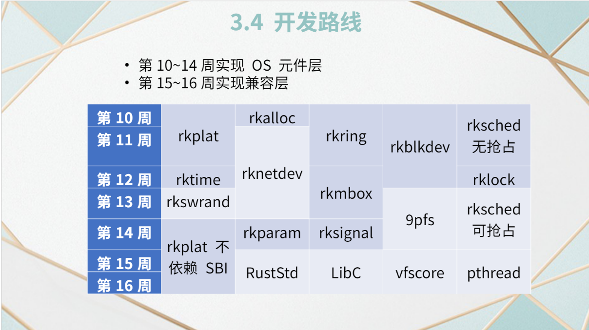

## Research report

### Targets:

[OSH-2022/x-realism](https://github.com/OSH-2022/x-realism)

[OSH-2022/x-runikraft](https://github.com/OSH-2022/x-runikraft)

[OSH-2022/x-QvQ](https://github.com/OSH-2022/x-QvQ)

> realism与runikraft均是与微内核的构建相关的，realism使用rust构建了一个微内核操作系统；runikraft基于unikraft项目也是用rust构建了一个微内核操作系统；QvQ则是基于redlef构建了一个可以在树莓派上运行的操作系统。

### Details:

#### 1. realism

1. 主要内容：

    `Rust`, `x86`,  `microkernel`, `降低IPC成本`

2. 技术要点/改进：

    1. 针对微内核架构IPC 成本高，上下文切换开销大：
        + 精简内核的规模，减少上下文切换的开销；共享内存通信；基于 seL4 快速路径思想实现高效 IPC。
    2. 针对于分页式内存管理的安全性问题：
        + 动态分页策略
        + 内核态使用的页表与用户态使用的页表隔离
    3. 使用rust的优点：高效、安全、社区友好，资源丰富

3. **中期技术路线**：

    1. 不链接标准库的情况下用rust构建一个最小化内核，可以裸机运行代码；搭建环境；完成基本的页表机制和任务调度模块
    2. 进程管理、调度与通信
    3. 内存管理（安全核心），实现动态内存分配，分页式内存管理，轻量级隔离
    4. 高效线程调度（基于第二步）
    5. 其他模块
    
    > 计划的进展过程相对来说清晰明确，循序渐进，较为模块化，便于分工协作；同时拓展空间较大，
    
4. 技术基础与参考
    + rCore: 清华大学的操作系统项目
    + Redox: 微内核设计的类Unix操作系统
    + sel4快速路径: 微内核附加前端, 加速 IPC 执行
    + blogOS: 系列博客，使用 Rust 创建了一个基于x86架构的小型操作系统

5. 设计与实现

    1. 问题与解决方案：

        +  IPC 开销较大：分别考虑计算密集型和 I/O 密集型场景并让用户选择操作系统要求

            > （实际上有一些偏向于专用化）

        + 修改 rCore 的 IPC：
        + 底层 Basic IPC 提供 `sys_recv` 和 `sys_send` 系统调用
            + 以进程 PID 替代文件标识符
            + 提供 rCore 本身的 easy-fs 作为**缺省文件系统**

    2. **实现的技术路线**

        1. Bare-metal

        2. 进程调度和 IPC

        3. 信号量机制和多线程机制

            管理互斥资源，实现同步；用户态实现多线程的执行环境；

        4. 文件系统等

    3. 部分细节

        1. 进程调度方式是**时间片轮转**
        2. rCore 的框架下实现了**时钟中断**的机制
        3. 快速路径由于与 seL4 具有较大的依赖性，不易移植，实现时没有使用。
        4. 实现了**信号量，互斥锁与多线程**
        5. 内核中没有文件系统，但预留了一套接口与easy-fs相适配
    4. 不足之处

        1. 没有找到突破现有微内核 IPC 瓶颈的根本方法

            > 通过牺牲一定程度的通用性来提高性能

        2. 没有经过大量进程同时工作的测试

    5. 可以扩展之处

        1. 中断机制提高IO性能
        2. 多核支持

Links：

> [x-realism/conclusion-v0.md at main · OSH-2022/x-realism (github.com)](https://github.com/OSH-2022/x-realism/blob/main/reports/conclusion-v0.md)
>
> [x-realism/mid_report.pptx at main · OSH-2022/x-realism (github.com)](https://github.com/OSH-2022/x-realism/blob/main/reports/mid_report.pptx)

#### 2. runikraft

1. 主要内容：

    `Rust`，`Unikernel`, `unikraft`, `RISC-V`.
    
    + `Unikernel`的高效低延迟、轻量级、高度优化
    + `Unikraft`的兼容性、模块化、高效API
    + `RISC-V`的简洁
    + `Rust`的安全可靠

2. 技术基础与参考

    1. `unikernel`
    2. **`unikraft`项目的系统架构**
    3. `RustyHermit`,`Nanos`
    4. `rCore`项目相关文档
    
3. 技术要点/改进

    1. 使用`Rust`增加安全性（很多项目都欠缺）
    1. 让`Unikernel`可以支持`RISC-V`架构（`Unikraft`欠缺的）
    1. 支持可选的**内存管理，进程调度，进程通讯，磁盘管理**功能，模块化

    > 综合分析了一些现有项目的不足

4. 技术路线

    > 元件层到兼容层。
    >
    > 规划十分明了清晰。

    

    

Links：

> [x-runikraft/midterm.pdf at master · OSH-2022/x-runikraft (github.com)](https://github.com/OSH-2022/x-runikraft/blob/master/report/4_midterm/midterm.pdf)

#### 3. QvQ

1. 主要内容：

    `Raspi`, `Rust`,`嵌入式`, `Redleaf设计模式`, `ARMv8`

2. 技术基础与参考

    1. **Redleaf的设计模式**
    2. `ARMv8`的一些结构
    3. 树莓派文档

3. 技术要点/改进

    1. 在Raspberriy上使用Redleaf设计模式

        > 模块化

    2. 优化内核组织结构与实现模块间高效通讯

        > 安全稳定

    3. 模块化适配部分驱动

4. 技术路线

    实现（在树莓派上运行）：

    1. boot
    2. 页映射
    3. 堆栈分配
    4. 轮转调度
    5. 外设驱动

5. 不足之处

    1. **ARMv8的复杂性**对具体实施造成了阻碍
    2. `boot`与`kernel`模块之上的完整架构没有完全实现

> Links：
>
> [x-QvQ/report.md at main · OSH-2022/x-QvQ (github.com)](https://github.com/OSH-2022/x-QvQ/blob/main/docs/final/report.md#----)