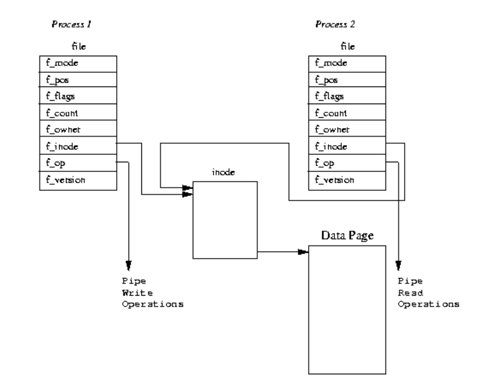
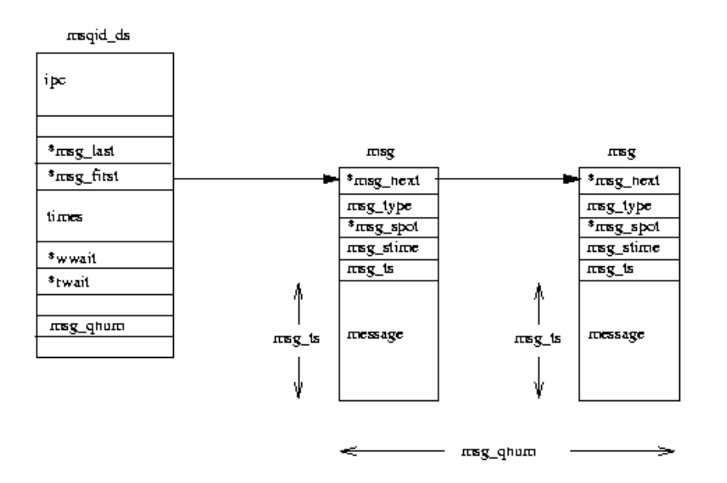
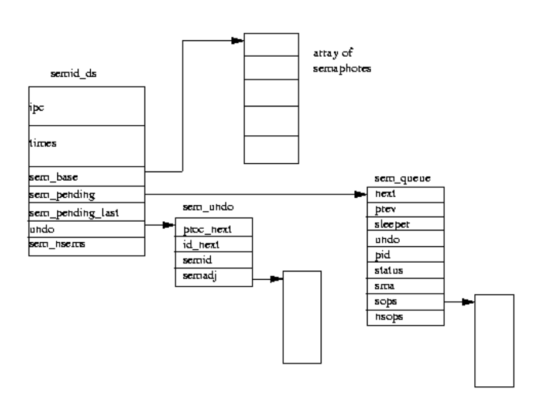
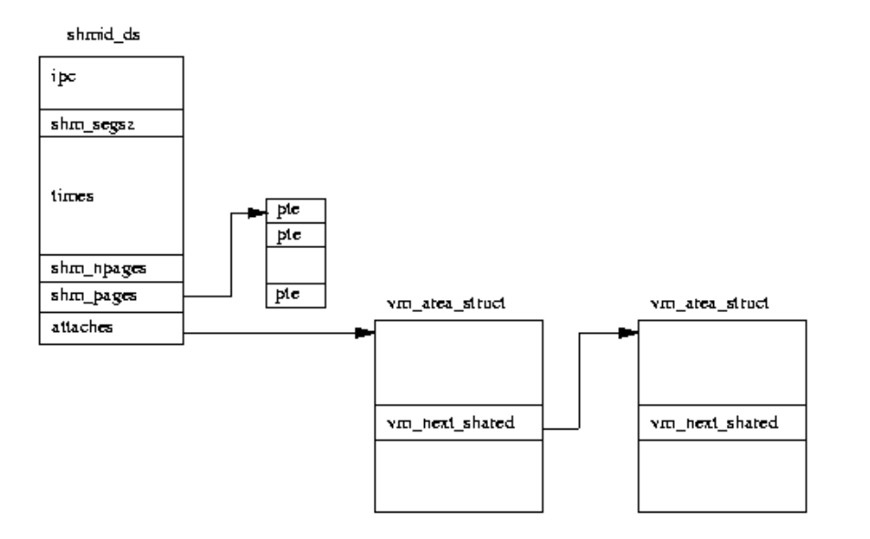

### Rearch——IPC part——Reference

> 本部分是对已有概念的搜集整理与简单整合复述。

**Reference：**

### Basic princeples of IPC

> **provides a mechanism to exchange data and information across multiple processes**

另一个较为有趣的说法是`IPC`是“*用户控制的上下文切换*”。

而在`SeL4`中，可以视作“*用于实现跨域函数调用的 seL4 机制*”。

#### Example1: Pipe

`pipe`的作用主要是将功能较简单的小模块结合在一起，从而实现较为复杂的功能。



最初`pipe`机制实现在`UNIX`中，将一个程序的输出连接到另一个程序的输入，通过`'|'` 符号来使用。利用`pipe`，可以有效地将`UNIX`功能强大但功能单一的部件结合在一起，实现较为复杂的功能。

`UNIX`中将`pipe`视为文件，基于统一的`file trait`接口实现开关与读写。文件的概念从使用者的角度淡化了实际文件与IO设备的差异，在一定程度上利于进行进程间通讯。

> ### Advantages:
>
> 简单，高效，可靠（检测数据传输中的错误并确保数据正确传递），灵活（实现各种通信协议，包括单向和双向通信）
>
> ### Disadvantages:
>
> 1. 容量有限
> 2. 单向：在单向管道中，一次只能有一个进程发送数据，这在某些情况下可能是不利的。
> 3. 同步：在双向管道中，进程必须同步以确保数据以正确的顺序传输。
> 4. 有限的可扩展性：管道仅限于同一台计算机上少数进程之间的通信，这在大规模分布式系统中可能是一个劣势。
>
> 总的来说，管道是一种有用的 IPC 技术，可以在同一台计算机上的进程之间进行简单高效的通信。但是，它们可能不适用于大规模分布式系统或需要双向通信的情况。


#### Example2: Signal

> 为适应单方向的通讯。一个进程可以通知其他进程终止或进行其他操作。在一定程度上类似于异步的硬件中断，因此可以视作一种软件实现的中断。

当一个信号发送给一个进程时，操作系统会中断接收到信号的进程，并对信号进行处理。存在一个默认的处理行为，在接收到的进程没有信号处理函数时执行。

进程发出信号时，指定响应对象的进程pid，由信号处理例程进行具体信号响应。信号接收的对象有多种应答方式：忽略，处理，终止。对此可以有一个枚举类型的编号。

> Examples of `linux signal`：https://man7.org/linux/man-pages/man7/signal.7.html
>
> Here are part of them:

```
       Signal      Standard   Action   Comment
       ────────────────────────────────────────
       SIGABRT      P1990      Core    Abort signal from abort(3)
       SIGCHLD      P1990      Ign     Child stopped or terminated
       SIGCLD         -        Ign     A synonym for SIGCHLD
       SIGCONT      P1990      Cont    Continue if stopped
       SIGINT       P1990      Term    Interrupt from keyboard
       SIGPIPE      P1990      Term    Broken pipe: write to pipe with no
                                       readers; see pipe(7)
       SIGSEGV      P1990      Core    Invalid memory reference
       SIGSTOP      P1990      Stop    Stop process
       SIGSYS       P2001      Core    Bad system call (SVr4);
                                       see also seccomp(2)
       SIGXCPU      P2001      Core    CPU time limit exceeded (4.2BSD);
                                       see setrlimit(2)
```

可见，比如`SIGABRT`, `SIGCHLD`, `SIGCONT`, `SIGSTOP`等是和进程相关的控制量，`SIGSEGV`在发生非法进程访问时起作用，`SIGXCPU`则与CPU运行时间相关。这里的信号有异步信号，也有同步信号，作用多样。

**信号处理的过程：**

用户态的进程接收到信号或者此进程触发了一些条件，因而陷入内核进程，检查此时是否接收到信号，如果有，则检查此进程是否有信号处理的例程，有则进入内核态处理，结束后使用`Sigreturn`系统调用进入内核态，恢复后继续执行；若否则按照内核的缺省方式处理，结束后继续进程执行。

### IPC in seL4

**先介绍一下L4与seL4（wiki）：**

> **L4**是一种[微内核](https://zh.wikipedia.org/wiki/微內核)构架的[操作系统](https://zh.wikipedia.org/wiki/作業系統)内核，最初由[约亨·李德克](https://zh.wikipedia.org/wiki/約亨·李德克)（Jochen Liedtke）设计，前身为[L3微内核](https://zh.wikipedia.org/wiki/L3微內核)。在最开始，L4只是一个由[约亨·李德克](https://zh.wikipedia.org/wiki/約亨·李德克)设计并实现的单一的产品，用于[Intel i386](https://zh.wikipedia.org/wiki/Intel_80386)上的一个高度优化内核。L4微内核系统由于其出色的性能和很小的体积而开始被计算机工业所认知。随后，L4的系统在多个方面上有了高速的发展。现在已经形成一个[微内核](https://zh.wikipedia.org/wiki/微內核)家族，包括[Pistachio](https://zh.wikipedia.org/w/index.php?title=Pistachio&action=edit&redlink=1)，[L4/MIPS](https://zh.wikipedia.org/w/index.php?title=L4/MIPS&action=edit&redlink=1)，与[Fiasco](https://zh.wikipedia.org/w/index.php?title=Fiasco&action=edit&redlink=1)。
>
> 2009年，Data61/CSIRO实现了对于其L4内核的形式化证明，并创造出世界上第一个此类的实用操作系统seL4。他们在2013年进一步证明了内核的信息流安全性，使得该系统成为最安全的操作系统之一。

#### `L4`的`IPC`

L4 中的 Ipc 始终是**同步且无缓冲**的：当且仅当**接收方已调用相应的 ipc 操作时，消息才会从发送方传输到接收方**。发送者处于阻塞状态，直到发生这种情况或发送者指定的时限已过且对方尚未准备好接收。

#### `SeL4`的`IPC`

`seL4`的IPC相比与其他操作系统较为特殊。它的IPC原语与其他操作系统提供的消息传递原语完全不同，甚至与原始的L4 IPC完全不同。

> In seL4, IPC is facilitated by small kernel objects known as ***endpoints***, which act as **general communication ports**. Invocations on endpoint objects are used to send and receive IPC messages.

在`SeL4`中，端点`endpoint`是通用的通信媒介，在功能上取代了`linux`中的`pipe`与`signal`。`SeL4`中的端点由一个线程队列组成，他们一起等待发送或接收，当一个队列在等待信息时，如果其中一个在端点发送一条信息，所有的等待中线程都接收到并被唤醒；如果此时另一个发送者又发送了一条信息，那么它将被移到等待队列。这样，`endpoint`就成为了一个公用的媒介，可以拥有不限数量的发送者与接收者。

`SeL4`中发送消息使用系统调用`seL_Send`，在其信息被其他线程接收前将被阻塞。另一个系统调用`seL4_NBSend`提供了轮询的方式。相似地，接收可以使用系统调用`seL4_Recv`与 `seL4_NBRecv` 。

**Buffer**

`SeL4`为每个线程都维护了一个`IPC buffer`，包含了对IPC有用的信息，比如数据内容和“capability”。发送者需要指定信息的大小（长度），这样操作系统在进行通讯时便可以将此信息从`Sender`的`buffer` copy 到`Receiver`的`buffer` 。对于短小的消息，可以直接通过消息寄存器`MR`传递，每一个`MR`都是机器字大小，即计算机进行一次整数运算所能处理的二进制数据的位数，这样就节省了copy的操作。

> A capability is a key that conveys specific rights to a particular object.
>
> 进程持有不可伪造的令牌来表示拥有请求某种服务的能力。令牌可以被复制，可以被转移，还可以通过IPC进行传输。令牌其实是一个指向存在于内核空间内核对象的指针，所以普通进程并不能修改自身以及其他进程的权限分配，但是内核可以对令牌指定的权限进行控制，从而保证了用户态不能绕过能力空间这个机制对系统服务造成滥用。

**Fastpath**

快速高效的IPC对微操作系统而言十分重要。快速路径是`SeL4`的一个亮点，它是内核之中经过高度优化的进程通讯传输路径。

> IPC has a fastpath – a heavily optimised path in the kernel – which allows these operations to be very fast.


### Works past pojects did

#### 2019-qwq

+ 对 seL4 的 Kernel 部分进行了改写，并调整了 seL4 的文件结构
+ 对 seL4 的 Object 部分进行了改写。补完了 Capability，提供了 TCB 和 Untyped 内存等重要的内核机制
+ 通过使用外语言函数接口，实现 C 源码与改造后的 Rust 代码的交互
+ 提下，利用 Rust 中的引用机制进行内核对象操作，极大减少了操作时的复制开销

> IPC部分是沿用Sel4的方式，体现了sel4进程间通讯的特性

#### 2021-selVM

+ 改写了SeL4非平台依赖的System Calls，包括Send、Recv、Call、Reply、Non-Blocking Send、Reply Recv等。
+ 使用cmake和ninja工具完成了C源码内核的编译，使用xargo和gcc完成了含有Rust源码的内核的编译，但未能成功链接含有Lua改写的seL4内核。
+ 成功测试了C源码内核与含有Rust改写的内核。

> 改写部分便包含大量与IPC相关的部分


### How mainstream OSs deal with IPC

#### 1. Linux

> 管道与信号此前已经提到，不再赘述。以下是一个简要的整理。
>
> https://tldp.org/LDP/tlk/ipc/ipc.html

##### 消息队列

消息队列允许一个或多个进程写入消息，这些消息将被一个或多个读取进程读取。Linux 维护了一个消息队列列表，即`msgque`向量；其中的每个元素都指向一个完整描述消息队列的`msqid_ds`数据结构。创建消息队列时，会从系统内存中分配一个新的`msqid_ds`数据结构并将其插入向量中。



> 可以双向，快速，但难以传递大量信息。

##### 信号量

信号量是内存中的一个位置，其值可以由多个进程测试和设置。就每个进程而言，测试和设置操作是不可中断的或原子的；一旦开始，没有什么能阻止它。测试和设置操作的结果是信号量的当前值和设置值相加，可以是正数也可以是负数。根据测试和设置操作的结果，一个进程可能必须休眠，直到信号量的值被另一个进程更改。信号量可用于实现*关键区域*，即一次只有一个进程应该执行的关键代码区域。



> 可以快速传达一些指示性的信息，内容有限。

##### 共享内存

共享内存允许一个或多个进程通过出现在它们所有虚拟地址空间中的内存进行通信。虚拟内存的页面由每个共享进程的页表中的页表条目引用。它不必在所有进程的虚拟内存中位于同一地址。对于所有 System V IPC 对象，对共享内存区域的访问是通过密钥和访问权限检查来控制的。一旦内存被共享，就不会检查进程如何使用它。它们必须依靠其他机制（例如 System V 信号量）来同步对内存的访问。



> **Advantages**
>
> + The communication process is very fast and bidirectional.
> + Multiple processes can use the shared memory.
> + Resources are saved.
>
> **Disadvantages**
>
> + Required concurrency control.
> + No protection of data.
> + Inconsistency of data occurred as updates were lost.

#### 2. Win

Windows 操作系统提供了促进应用程序之间通信和数据共享的机制。总的来说，由这些机制启用的活动称为*进程间通信*(IPC)。某些形式的 IPC 促进了几个专门过程之间的劳动分工。其他形式的 IPC 有助于网络上计算机之间的分工。

Different methods：

> 1. [Using the Clipboard for IPC](https://learn.microsoft.com/en-us/windows/win32/ipc/interprocess-communications#using-the-clipboard-for-ipc)
> 2. [Using COM for IPC](https://learn.microsoft.com/en-us/windows/win32/ipc/interprocess-communications#using-com-for-ipc)
> 3. [Using Data Copy for IPC](https://learn.microsoft.com/en-us/windows/win32/ipc/interprocess-communications#using-data-copy-for-ipc)
> 4. [Using DDE for IPC](https://learn.microsoft.com/en-us/windows/win32/ipc/interprocess-communications#using-dde-for-ipc)
> 5. [Using a File Mapping for IPC](https://learn.microsoft.com/en-us/windows/win32/ipc/interprocess-communications#using-a-file-mapping-for-ipc)
> 6. [Using a Mailslot for IPC](https://learn.microsoft.com/en-us/windows/win32/ipc/interprocess-communications#using-a-mailslot-for-ipc)
> 7. [Using Pipes for IPC](https://learn.microsoft.com/en-us/windows/win32/ipc/interprocess-communications#using-pipes-for-ipc)
> 8. [Using RPC for IPC](https://learn.microsoft.com/en-us/windows/win32/ipc/interprocess-communications#using-rpc-for-ipc)
> 9. [Using Windows Sockets for IPC](https://learn.microsoft.com/en-us/windows/win32/ipc/interprocess-communications#using-windows-sockets-for-ipc)

> windows提供的方式多种多样，不同的方式有各自的适用场景，其中比较经典和通用的是管道，这与作为微内核的SeL4是显著不同的。对于我们的项目而言，目前并不会通过如此繁多的方式实现IPC。

#### MacOS

> 主要是以下三种：
>
> + 基于POSIX的实现，其中常见的是基于Socket (TCP/IP)的实现
> + 基于 底层信号机制，mac系统的内核组件就是使用mach_mag来传递消息
> + Foundation库里提供的一些类库
>
> 2011年的时候推出全新的XPC进程间通信的方案，目的是提高 App 的安全性和稳定性。XPC实现了权限隔离, 使得 App Sandbox 更加完备； 同时让进程间通信变得更容易。


### Reference links

> http://rcore-os.cn/rCore-Tutorial-Book-v3/chapter7/0intro.html
>
> [x-realism/2022.4.7 research-lly.md at main · OSH-2022/x-realism (github.com)](https://github.com/OSH-2022/x-realism/blob/main/reports/research/2022.4.7 research-lly.md)
>
> https://en.wikipedia.org/wiki/L4_microkernel_family
>
> https://os.inf.tu-dresden.de/L4/l4libman/l4_ipc.html
>
> https://docs.sel4.systems/Tutorials/ipc.html
>
> [How to (and how not to) use seL4 IPC | microkerneldude](https://microkerneldude.org/2019/03/07/how-to-and-how-not-to-use-sel4-ipc/)
>
> [x-qwq/Final-report.md at master · OSH-2019/x-qwq (github.com)](https://github.com/OSH-2019/x-qwq/blob/master/docs/Final-report.md#成果汇报)
>
> [x-seLVM/Final-Report.md at main · OSH-2021/x-seLVM (github.com)](https://github.com/OSH-2021/x-seLVM/blob/main/docs/Final-Report.md)
>
> https://tldp.org/LDP/tlk/ipc/ipc.html
>
> https://www.geeksforgeeks.org/ipc-technique-pipes/
>
> https://www.watelectronics.com/inter-process-communication/
>
> https://learn.microsoft.com/en-us/windows/win32/ipc/interprocess-communications
>
> http://fancymax.github.io/2018/06/13/xpc/
>
> https://learn.microsoft.com/zh-cn/windows/win32/ipc/interprocess-communications
>
> [Optimizing Interprocess Communication for Best Performance in Real-Time Systems ](https://d.wanfangdata.com.cn/conference/ChZDb25mZXJlbmNlTmV3UzIwMjMwMjI3EgxDQzAyMTE4MDA3MzkaCHhrZWtsZGk5)
>
> [Message-passing interprocess communication design in seL4 | IEEE Conference Publication | IEEE Xplore](https://ieeexplore.ieee.org/document/8070192)

