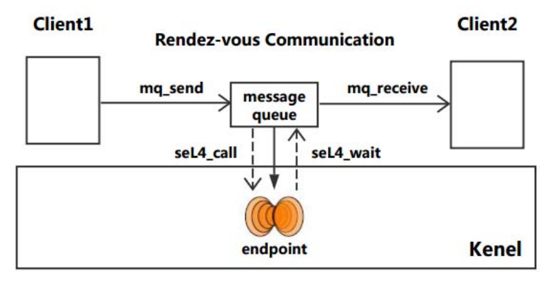

## Rearch: IPC part

### Basic princeples of IPC

#### Importance: 1.Why do we need IPC?

单个进程可以很强大，但其功能毕竟是有限的。当我们需要结合多个进程功能以共同完成同一项工作时，进程间通讯就极为重要。

实质上，IPC提供了在不同进程或线程之间的数据交互。

#### Importance: 2. What can efficient IPC bring us?

+ 相对于低效的IPC，节省了进程间相互等待的时间
+ 不同进程间的高效的信息共享有助于扩展单进程的功能，组合完成复杂任务
+ 可以避免在单个进程中用相对低效的手段实现功能，因为可以与有能力更有效完成任务的进程交互
+ 在增强不同模块之间的隔离的情况下依然能够高效完成工作

### Traditional implementations

在`Reference`中有介绍，这里列出基本方式与评价。

+ `pipe`

    > 简单，高效，可靠（检测数据传输中的错误并确保数据正确传递），灵活（实现各种通信协议，包括单向和双向通信）
    >
    > 也存在一些缺点：
    >
    > 1. 容量有限
    > 2. 单向：在单向管道中，一次只能有一个进程发送数据，这在某些情况下可能是不利的。
    > 3. 同步：在双向管道中，进程必须同步以确保数据以正确的顺序传输。
    > 4. 有限的可扩展性：管道仅限于同一台计算机上少数进程之间的通信，这在大规模分布式系统中可能是一个劣势。
    >
    > 总的来说，管道是一种有用的 IPC 技术，可以在同一台计算机上的进程之间进行简单高效的通信。但是，它们可能不适用于大规模分布式系统或需要双向通信的情况。

+ `Signal`

    > 为适应单方向的通讯。一个进程可以通知其他进程终止或进行其他操作。在一定程度上类似于异步的硬件中断，因此可以视作一种软件实现的中断。

+ `message queue`

    > 可以双向，快速，但难以传递大量信息。

+ `semaphore`

    > 可以快速传达一些指示性的信息，内容有限。

+ `Shared memory`

    > 可以快速、双向交互并且支持多进程。
    >
    > 但同时访问的管理与数据安全与一致性的确保较为困难。

### How SeL4 deal with IPC?

**先介绍一下L4与seL4（wiki）：**

> **L4**是一种[微内核](https://zh.wikipedia.org/wiki/微內核)构架的[操作系统](https://zh.wikipedia.org/wiki/作業系統)内核，最初由[约亨·李德克](https://zh.wikipedia.org/wiki/約亨·李德克)（Jochen Liedtke）设计，前身为[L3微内核](https://zh.wikipedia.org/wiki/L3微內核)。在最开始，L4只是一个由[约亨·李德克](https://zh.wikipedia.org/wiki/約亨·李德克)设计并实现的单一的产品，用于[Intel i386](https://zh.wikipedia.org/wiki/Intel_80386)上的一个高度优化内核。L4微内核系统由于其出色的性能和很小的体积而开始被计算机工业所认知。随后，L4的系统在多个方面上有了高速的发展。现在已经形成一个[微内核](https://zh.wikipedia.org/wiki/微內核)家族，包括[Pistachio](https://zh.wikipedia.org/w/index.php?title=Pistachio&action=edit&redlink=1)，[L4/MIPS](https://zh.wikipedia.org/w/index.php?title=L4/MIPS&action=edit&redlink=1)，与[Fiasco](https://zh.wikipedia.org/w/index.php?title=Fiasco&action=edit&redlink=1)。
>
> 2009年，Data61/CSIRO实现了对于其L4内核的形式化证明，并创造出世界上第一个此类的实用操作系统seL4。他们在2013年进一步证明了内核的信息流安全性，使得该系统成为最安全的操作系统之一。

#### `L4`的`IPC`

L4 中的 Ipc 始终是**同步且无缓冲**的：当且仅当**接收方已调用相应的 ipc 操作时，消息才会从发送方传输到接收方**。发送者处于阻塞状态，直到发生这种情况或发送者指定的时限已过且对方尚未准备好接收。

#### `SeL4`的`IPC`

`seL4`的IPC相比与其他操作系统较为特殊，没有使用一些经典的机制。在`SeL4`中，使用内核提供的数据结构端点（`endpoint`）进行通讯，在功能上取代了`linux`中的`pipe`与`signal`等多种机制。

`SeL4`中的端点可以看作一个通用的交互端口，由一个线程队列组成，他们一起等待发送或接收，当一个队列在等待信息时，如果其中一个在端点发送一条信息，所有的等待中线程都接收到并被唤醒；如果此时另一个发送者又发送了一条信息，那么它将被移到等待队列。这样，`endpoint`就成为了一个公用的媒介，可以拥有不限数量的发送者与接收者。

`SeL4`为每个线程都维护了一个`IPC buffer`，包含了对IPC有用的信息，比如数据内容和`capability`。发送者需要指定信息的大小（长度），这样操作系统在进行通讯时便可以将此信息从`Sender`的`buffer` copy 到`Receiver`的`buffer` 。对于短小的消息，可以直接通过消息寄存器`MR`传递，每一个`MR`都是机器字大小，即计算机进行一次整数运算所能处理的二进制数据的位数，这样就节省了copy的操作。

`SeL4`中发送消息使用系统调用`seL_Send`，在其信息被其他线程接收前将被阻塞。另一个系统调用`seL4_NBSend`提供了轮询的方式。相似地，接收可以使用系统调用`seL4_Recv`与 `seL4_NBRecv` 。

### Works past pojects did

#### 2019-qwq

+ 对 seL4 的 Kernel 部分进行了改写，并调整了 seL4 的文件结构
+ 对 seL4 的 Object 部分进行了改写。补完了 Capability，提供了 TCB 和 Untyped 内存等重要的内核机制
+ 通过使用外语言函数接口，实现 C 源码与改造后的 Rust 代码的交互
+ 提下，利用 Rust 中的引用机制进行内核对象操作，极大减少了操作时的复制开销

> IPC部分是沿用Sel4的方式，体现了sel4进程间通讯的特性

#### 2021-selVM

+ 改写了SeL4非平台依赖的System Calls，包括Send、Recv、Call、Reply、Non-Blocking Send、Reply Recv等。
+ 使用cmake和ninja工具完成了C源码内核的编译，使用xargo和gcc完成了含有Rust源码的内核的编译，但未能成功链接含有Lua改写的seL4内核。
+ 成功测试了C源码内核与含有Rust改写的内核。

> 改写部分便包含大量与IPC相关的部分

### 目前对于IPC部分的计划

基于`SeL4`自身具有的`IPC`优秀表现，目前我们打算沿用`SeL4`的设计，以达到进程间通讯的高效。

