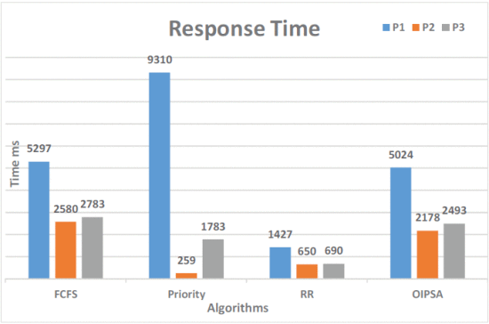
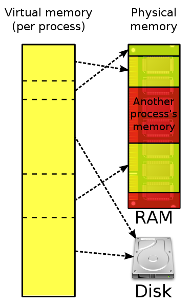
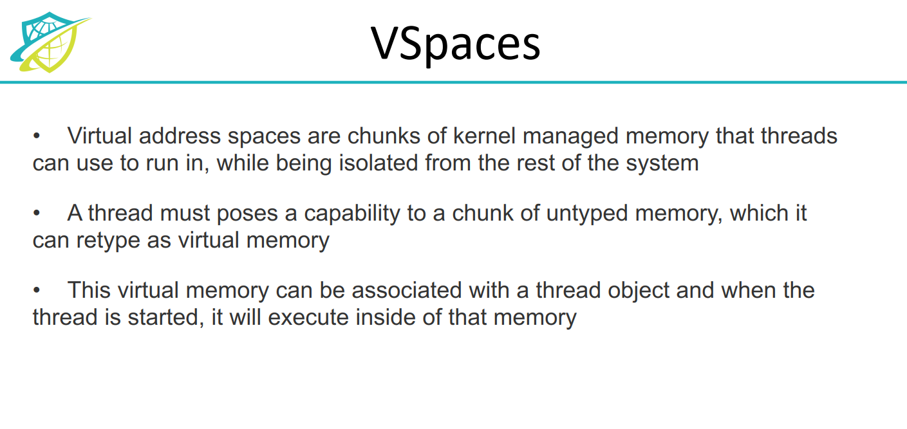

# Research
## 目录
* 1. [项目背景](#)
	* 1.1. [**sel4简介**](#sel4)
		* 1.1.1. [特点](#-1)
	* 1.2. [Rust](#Rust)
		* 1.2.1. [高性能（Performance）](#Performance)
		* 1.2.2. [可靠性（Reliability）](#Reliability)
		* 1.2.3. [生产力](#-1)
* 2. [理论依据](#-1)
	* 2.1. [`SeL4`](#SeL4)
		* 2.1.1. [特性](#-1)
		* 2.1.2. [内核基本服务清单](#-1)
		* 2.1.3. [访问控制](#-1)
		* 2.1.4. [系统调用](#-1)
		* 2.1.5. [内核对象](#-1)
		* 2.1.6. [内核内存分配](#-1)
		* 2.1.7. [SeL4小结](#SeL4-1)
	* 2.2. [调度算法](#-1)
	* 2.3. [**微内核的优势和缺陷**](#-1)
	* 2.4. [虚拟内存](#-1)
	* 2.5. [seL4 中和虚拟内存有关的名词](#seL4)
		* 2.5.1. [Virtualization on seL4](#VirtualizationonseL4)
		* 2.5.2. [VSpaces](#VSpaces)
	* 2.6. [上下文切换](#-1)
	* 2.7. [IPC](#IPC)
		* 2.7.1. [`SeL4`的`IPC`](#SeL4IPC)
		* 2.7.2. [Advantages of IPC in SeL4](#AdvantagesofIPCinSeL4)
		* 2.7.3. [Importance: 1.Why do we need IPC?](#Importance:1.WhydoweneedIPC)
		* 2.7.4. [Importance: 2. What can efficient IPC bring us?](#Importance:2.WhatcanefficientIPCbringus)
		* 2.7.5. [Traditional implementations](#Traditionalimplementations)
* 3. [初步计划与想法](#-1)
	* 3.1. [**我们关于文件系统的想法**](#-1)
	* 3.2. [我们关于上下文切换的想法](#-1)
	* 3.3. [我们关于 IPC 的想法](#IPC-1)
* 4. [相关工作](#-1)
	* 4.1. [往年相关小组做过的一些工作](#-1)
		* 4.1.1. [2019-qwq](#qwq)
		* 4.1.2. [2021-selVM](#selVM)

##  1. 项目背景

###  1.1. **sel4简介**
seL4是世界上**最小的内核之中的一个**，可是seL4的性能能够与当今性能最好的微内核相比。
 作为微内核，seL4为应用程序提供少量的服务。如创建和管理虚拟内存地址空间的抽象，线程和进程间通信IPC。这么少的服务靠**8700**行C代码搞定。seL4是高性能的L4微内核家族的新产物，它具有操作系统所必需的服务。如线程，IPC，虚拟内存，中断等。

seL4 是第一个（也是唯一一个）具有合理和完整及时性分析的保护模式操作系统内核。除此之外，这意味着它在中断延迟（以及任何其他内核操作的延迟）方面具有可证明的上限。因此，它是唯一具有内存保护功能的内核，可以为您提供硬实时保证。

sel4的问题：separation-kernel 配置的 seL4 保证数据保密性 (confidentiality)，也就是**没有授权就不能读取数据**。 但这个证明没有考虑时间，还不能杜绝 timing channel 。 seL4 目前用的信息流记号局限很大，只适用于很窄的现实场景， 还需要寻找一个更实用的 confidentiality notion。

####  1.1.1. 特点

seL4是一个高安全性、高性能的操作系统微内核，是L4系列微内核中的一个，由Trustworthy Systems Group于2009年发布，支持主流的ARM、x86和RISC-V架构，现已开源并成立基金会。

seL4的突出特点在于其经过形式化验证的安全性，以及保障安全性的同时所具有的高性能，在对于安全性要求较高的军事、商业、政治领域有着众多应用场景。

###  1.2. Rust

Rust 是由 Mozilla 研究室主导开发的一门现代系统编程语言,运行效率与C/C++一个级别，且具有极高的安全性，在保证内存安全和线程安全的同时使编译后的程序运行速度极快，Rust还提供函数式编程语言的模式匹配和类型推导，Rust是一门赋予每个人构建可靠且高效软件能力的语言。它的优越性主要体现在高性能，可靠性和生产力三个方面：

####  1.2.1. 高性能（Performance）

Rust 速度惊人且内存利用率极高。由于没有运行时和垃圾回收，它能够胜任对性能要求特别高的服务，可以在嵌入式设备上运行，还能轻松和其他语言集成。

##### 可执行文件

Rust是编译语言，这意味着程序直接转换为可执行的机器代码，因此可以将程序作为单个二进制文件进行部署；与 Python 和 Ruby 等解释型语言不同，无需随程序一起分发解释器，大量库和依赖项，这是一大优势。与解释型语言相比，Rust 程序非常快。

##### 对动态类型语言与静态类型的平衡

动态类型语言在调试、运行时具有不确定性，而静态类型的语言减少了程序理解的开销和动态运行的不确定性，但并不是所有静态类型系统都是高效的。Rust使用可选类型对这种可能性进行编码，并且编译器要求你处理`None`这种情况。这样可以防止发生可怕的运行时错误（或等效语言），而可以将其提升为你在用户看到它之前解决的编译时错误。Rust的静态类型尽最大努力避免程序员的麻烦，同时鼓励长期的可维护性。一些静态类型的语言给程序员带来了沉重的负担，要求他们多次重复变量的类型，这阻碍了可读性和重构。其他静态类型的语言允许在全局进行数据类型推断。虽然在最初的开发过程中很方便，但是这会降低编译器在类型不再匹配时提供有用的错误信息的能力。Rust可以从这两种样式中学习，并要求顶层项（如函数参数和常量）具有显式类型，同时允许在函数体内部进行类型推断。

##### 解决垃圾回收问题

Rust可以选择将数据存储在堆栈上还是堆上，并在编译时确定何时不再需要内存并可以对其进行清理。这样可以有效利用内存，并实现更高性能的内存访问。Tilde是Rust在其Skylight产品中的早期生产用户，他发现通过使用Rust重写某些Java HTTP服务，他们能够将内存使用量从5Gb减少到50Mb。无需连续运行垃圾收集器，Rust项目非常适合被其他编程语言通过外部功能接口用作库。这使现有项目可以用快速的Rust代码替换对性能至关重要的代码，而不会产生其他系统编程语言固有的内存安全风险。某些项目甚至已使用这些技术在Rust中进行了增量重写。通过直接访问硬件和内存，Rust是嵌入式和裸机开发的理想语言你您可以编写底层代码，例如操作系统内核或微控制器应用程序。在这些特别具有挑战性的环境中，Rust的核心类型和功能以及可重用的库代码表现将会非常出色。

####  1.2.2. 可靠性（Reliability）

Rust 丰富的类型系统和所有权模型保证了内存安全和线程安全，让您在编译期就能够消除各种各样的错误。

##### 处理系统级编程

与其他系统级编程语言（例如C或C ++）相比，Rust可以提供的最大好处是借阅检查器。这是编译器的一部分，负责确保引用不会超出引用的数据寿命，并有助于消除由于内存不安全而导致的所有类型的错误。与许多现有的系统编程语言不同，Rust不需要你将所有时间都花在细节上。Rust力求拥有尽可能多的*零成本抽象*，这种抽象与等效的手写代码具有同等的性能。当安全的Rust无法表达某些概念时，ref="[http://cliffle.com/p/dangerust/](https://link.zhihu.com/?target=http%3A//cliffle.com/p/dangerust/)">可以使用不安全的 Rust。这样可以释放一些额外的功能，但作为交换，程序员现在有责任确保代码真正安全。然后，可以将这种不安全的代码包装在更高级别的抽象中，以确保抽象的所有使用都是安全的。使用不安全的代码应该是一个经过深思熟虑的决定，因为正确使用它需要与负责避免未定义行为的任何其他语言一样多的思考和关心。最小化不安全代码是最小化由于内存不安全而导致段错误和漏洞的可能性的最佳方法。系统性编程语言有一种天生的使命，即它们必须永远有效地存在。尽管某些现代软件并不需要那么长的使用寿命，但许多企业希望其辛苦编写代码库在可预见的将来能够一直使用。

##### 并发编程更容易

Rust通过防止编译时的数据竞争，使编写并发程序变得更加容易。当来自不同线程的至少两个不同指令尝试同时访问相同的内存位置，而其中至少一个尝试写入某些内容并且没有同步可以在各种访问之间设置任何特定顺序时，就会发生数据争用。未定义对内存的访问而不进行同步。在 Rust 中，检测到数据竞争。如果给定的对象访问不支持许多线程（即没有标记适当的特征），则需要通过互斥锁进行同步，该互斥锁将锁定其他线程对该特定对象的访问。为了确保对对象执行的操作不会破坏它，只有一个线程可以访问它。从其他线程的角度来看，对此对象的操作是原子的，这意味着观察到的对象状态始终是正确的，并且您无法观察到另一个线程对此对象执行的操作导致的任何中间状态。Rust 语言可以检查我们是否对此类对象执行了任何不正确的操作，并在编译时通知我们。

####  1.2.3. 生产力

Rust 拥有出色的文档、友好的编译器和清晰的错误提示信息， 还集成了一流的工具——包管理器和构建工具， 智能地自动补全和类型检验的多编辑器支持， 以及自动格式化代码等等。

##### Cargo包管理器

Rust 由于有 Cargo 这样一个非常出色的包管理工具，周边的第三方库发展非常迅速，各个领域都有比较成熟的库，比如 HTTP 库有 Hyper，异步 IO 库有 Tokio, mio 等，基本上构建后端应用必须的库 Rust 都已经比较齐备。 总体来说，现阶段 Rust 定位的方向还是高性能服务器端程序开发，另外类型系统和语法层面上的创新也使得其可以作为开发 DSL 的利器。

Cargp被公认为 Rust 生态系统的非凡优势之一。如果没有 Cargo，我们将不得不搜索库，从 GitHub 从未知来源下载这些库，构建为静态库箱，将它们链接到程序。这一切是多么痛苦。但是我们有 Cargo 在与 Rust 合作时为我们完成所有这些工作。

##  2. 理论依据

###  2.1. `SeL4`
####  2.1.1. 特性

##### 最小化原则

seL4作为一个微内核，为所有系统服务和用户程序提供资源的访问控制、为各个系统组件提供通信，是操作系统的核心部分，具有优先权限。seL4坚持了微内核的“最小化原则”，将大量的硬件驱动和系统服务裁减掉，甚至将内核内存分配和时间片分配丢到用户空间中，以实现微内核的最小化。由此带来的好处是拥有许多的应用场景，为场景中的多种操作系统提供可靠的基础支持。

##### 安全性

L4系列微内核已经是全球最先进、最安全的操作系统内核，而seL4又在其中出类拔萃。seL4是世界上第一个且是迄今为止唯一一个经过安全性形式验证的操作系统。seL4的安全性表现为在它为系统中运行的应用程序之间的隔离提供了最高的保证 ，这意味着可以遏制系统某一部分的妥协，并防止损害该系统其他可能更关键的部分。

##### 性能

正如seL4官网标题下的第一条标语：“Security is no excuse for bad performance（安全性不是降低性能的借口）”，seL4在保障了首屈一指的安全性的同时也兼顾了其性能。seL4的性能较此前的系统内核不仅没有降低，反而得到了增强。一个显著的指标就是其IPC时间较之其他的OS内核减少了至少一半。

####  2.1.2. 内核基本服务清单

1.线程抽象：支持运行软件的CPU执行；

2.分配地址空间：为应用程序提供虚拟的内存空间，使应用程序只能访问该空间中的内存而不会破坏系统空间；

3.管理进程间通信：允许进程间通过端点进行数据传输，协调各个进程的资源占用和释放；

4.通知：提供类似于二进制信号量的非阻塞信号机制，让进程的数据访问更加高效；

5.设备原语：将设备驱动程序作为非特权应用程序实现，内核通过IPC消息导出硬件设备中断；

6.分配功能空间：分配存储内核服务的内存空间并设置特权权限。

####  2.1.3. 访问控制

seL4微内核提供了一个基于功能的访问控制模型。访问控制管理所有内核服务，为了执行操作，应用程序必须调用其拥有的对请求的服务具有足够访问权限的功能。

访问控制将操作系统配置为相互隔离的软件组件，通过有选择地授予特定的通信能力，在组件之间启用授权的、受控的通信，使得软件组件具有高度保证的隔离，因为只有那些由能力占有明确授权的操作才被允许。

####  2.1.4. 系统调用

seL4内核提供了一个用于在线程之间传递消息的服务，该机制还用于与内核提供的服务进行通信。该通信服务传递的消息具有标准的格式，每个消息包含一些数据字和一些可能的功能。

线程通过调用其功能空间中的功能来发送消息，当以这种方式调用一个端点功能时，消息将通过内核传输到另一个线程。当调用内核对象的功能时，消息将被解释为以特定于内核对象类型的方式进行的方法调用。

逻辑上，内核提供三个系统调用：发送、接收和输出。除此之外，还有一些基本的Send和Receive调用的组合和变体，如Call操作，由来自同一个对象的一个Send和一个Receive组成。除了端点和通知之外，内核对象上的方法都映射到发送或调用，具体映射到哪种方法取决于方法是否返回结果。
####  2.1.5. 内核对象

seL4微内核中实现了一些对象类型，这些类型的实例（也称为“对象”）可以由应用程序调用，而这些对象的接口也构成了内核本身的接口。内核服务的创建和使用是通过创建、操作和组合这些对象来实现的。具体的对象类型如下：

1.**CNodes**:存储功能，允许线同时优化的方向有：usty等ian以y语言编写。于结点的创建时间，插槽可以是空的也可以包含功能;

2.**TCB**（线程控制块）:表示seL4中的一个运行线程，线程是调度、阻塞、非阻塞等的执行单元，具体执行的内容取决于应用程序与其他线程的交互;

3.**Endpoints**（端点）：负责进程之间的消息传输。通过端点进行的IPC是同步的，试图在端电上发送或接收消息的线程会阻塞，直到消息可以传递为止，这意味着只有当发送者和接收者在端点汇合时，消息传递才会发生，内核可以通过一个拷贝传递消息。端点的功能可以被限制为只发送或只接收。端点功能可以拥有授予权，这允许将功能作为消息的一部分发送;

4.**通知对象**：提供一个简单的信号机制。一个通知是1Byte大小的标志数组，每个标志的行为都像一个二进制信号量。在单个操作中向标志的子集发出信号，轮询检查所有标志，并保持阻塞直到某一标志作为标志被发出。通知功能可以是仅限信号的或仅限等待的;

5.**虚拟地址空间对象**：用于为一个或多个线程构造虚拟地址空间，这些对象很大程度上直接对应于硬件对象，因此依赖于体系结构。内核还包括用于跟踪地址空间状态的ASID池和ASID控制对象;

6.**中断对象**：中断对象给应用程序接收和确认来自硬件设备的中断的能力。最初，IRQControl有一个功能，它允许创建IRQHandler功能。IRQHandler功能允许管理与特定设备相关联的特定中断源。它被委托给一个设备驱动程序来访问中断源。IRQHandler对象允许线程等待并确认单个中断;

7.**非类型化内存**：无类型内存是sel4内核中内存分配的基础。非类型化内存功能只有一个方法：创建新的内核对象。如果方法成功，调用线程将获得对新创建对象的功能的访问权。此外，非类型化内存对象可以划分为一组较小的非类型化内存对象，允许委托部分(或全部)系统内存。

####  2.1.6. 内核内存分配

seL4微内被称为原始无类型内存对象的子对象。

使用seL4 Untyped Retype()创建对象的用户级应用程序，将接收对结果对象的全部权限。然后，它可以将其对该对象拥有的全部或部分权限委托给一个或多个客户端。

非类型化内存对象表示两种不同类型的内存：通用内存或设备内存。 通用内存可以非类型化为任何其他对象类型，并接受内核提供的非类型化内存上的任何操作。设备内存覆盖由硬件平台决定的为设备预留的内存区域，这些对象的使用受到内核以下方式的限制:

1. 设备非类型化对象只能重新键入到帧或其他非类型化对象中；例如，开发人员不能从设备内存创建端点；
2. 从设备中重新类型化的帧对象不能设置为线程IPC缓冲区，或用于创建ASID池；

子无类型对象的类型属性继承自父亲的无类型对象，也就是说，未类型化设备的任何子设备也将是一个未类型化设备。开发人员不能更改无类型的类型属性。

####  2.1.7. SeL4小结

seL4操作系统微内核在达到了极高的安全标准的同时兼顾了良好的性能，其微内核式的设计也为其向各个平台移植打下了坚实的基础。seL4的开源有利于本项目进行深入研究、探讨、参考和借鉴。目前暂定的seL4借鉴内容有：微内核结构、安全性实现、访问控制与进程隔离；要进行修改的内容有：进程间通信、rust语言编写。

###  2.2. 调度算法

sel4采用可抢占的轮转调度。我们对sel4进程调度算法优化的可能性进行了研讨。

**多级反馈队列**

多级反馈队列（Multilevel Feedback Queue Scheduling）是一种基于反馈的调度算法。它使用多个调度队列，每种队列对应一种优先级，只有高优先级的任务执行完成才会执行更低优先级的任务。每个队列内部可以使用一种调度算法，如轮转调度，每次给一个任务一定的时间片，若进程耗尽时间片仍未执行完成则会进入更低优先级的队列。
  
**智能进程调度**

智能进程调度（Intelligent Process Scheduling）是利用人工智能技术进行进程调度的方法。它运用机器学习和数据分析技术，通过对过去大量运行数据的分析，尝试预测进程的行为模式，并作出相应调度。相比传统调度算法，它更能适应不同工作环境，可以最大限度提高系统的资源利用率并减小响应时间。目前，该项技术仍在研究验证当中。

我们在讨论中探讨了实现智能进程调度的可行性，参考了论文（[Organization Based Intelligent Process Scheduling Algorithm](https://ieeexplore.ieee.org/abstract/document/7313978)），得出的结论是在较小的规模内，采用智能进程调度得到的优化并不明显。

*论文中与传统算法响应时间的比较*

###  2.3. **微内核的优势和缺陷**
  
微内核只提供操作系统最为核心的功能，如进程间通讯和内存管理，而其他功能如文件系统在内核外部，以用户程序的形式存在。将内核保持在最小限度的好处在于，增加了可维护性和安全性，代码量减少，c

的可能性也就小，并且通过将各个部分隔离开来，一个部分出现问题不会导致整个内核的崩溃。

但随之带来的问题是，各个组件之间的通信会增加开销，造成性能在一定程度的下降。

###  2.4. 虚拟内存

**虚拟内存**指操作系统提供的逻辑内存。其将物理上离散的内存以及 分布在 Disk（低速） 与 RAM （高速）中的内存映射成逻辑上的**连续内存**。（Wiki）[[Virtual memory - Wikipedia](https://en.wikipedia.org/wiki/Virtual_memory)]()

而据我们调查，seL4 自身似乎并没有设计虚拟内存相关的功能。

###  2.5. seL4 中和虚拟内存有关的名词

####  2.5.1. Virtualization on seL4

​		但是这里指的是**虚拟化**，指的是将硬件层面的“虚拟化”, 将物理元件抽象化，提供统一的借口，比如虚拟机。[[What is Virtualization? | IBM](https://www.ibm.com/topics/virtualization)]()

​		对于seL4，官方文档说 seL4 自身没有虚拟化，但是提供了两个库函数或者接口（libraries）。与虚拟内存关联不大。[[What is Virtualization? | IBM](https://www.ibm.com/topics/virtualization)]()

####  2.5.2. VSpaces

​		来源：[[t1-03-evancich.pdf (ieee.org)](http://secdev.ieee.org/wp-content/uploads/2020/11/t1-03-evancich.pdf)]

​		这里，虚拟地址空间指的是程序运行时分配的虚拟
空间。程序运行s不能超过该空间xianeL4只提供最基础的硬件页表功能，其余虚拟内存功能均需要用户态来提供支持。[https://docs.sel4.systems/Tutorials/mapping.html]()。

###  2.6. 上下文切换

seL4是一个高度安全的微内核，由于其强大的形式化验证，它可以保证在正确配置的情况下，上下文切换是正确的、可预测的和无副作用的。然而，在某些情况下，可能会出现一些问题，如时间开销、内存使用等。

###  2.7. IPC

####  2.7.1. `SeL4`的`IPC`

`seL4`的IPC相比与其他操作系统较为特殊，没有使用一些经典的机制。在`SeL4`中，使用内核提供的数据结构端点（`endpoint`）进行通讯，在功能上取代了`linux`中的`pipe`与`signal`等多种机制。

`SeL4`中的端点可以看作一个通用的交互端口，由一个线程队列组成，他们一起等待发送或接收，当一个队列在等待信息时，如果其中一个在端点发送一条信息，所有的等待中线程都接收到并被唤醒；如果此时另一个发送者又发送了一条信息，那么它将被移到等待队列。这样，`endpoint`就成为了一个公用的媒介，可以拥有不限数量的发送者与接收者。

`SeL4`为每个线程都维护了一个`IPC buffer`，包含了对IPC有用的信息，比如数据内容和`capability`。发送者需要指定信息的大小（长度），这样操作系统在进行通讯时便可以将此信息从`Sender`的`buffer` `copy` 到 `Receiver` 的 `buffer`。对于短小的消息，可以直接通过消息寄存器`MR`传递，每一个`MR`都是机器字大小，即计算机进行一次整数运算所能处理的二进制数据的位数，这样就节省了copy的操作。

`SeL4`中发送消息使用系统调用`seL_Send`，在其信息被其他线程接收前将被阻塞。另一个系统调用`seL4_NBSend`提供了轮询的方式。相似地，接收可以使用系统调用`seL4_Recv`与 `seL4_NBRecv` 。

####  2.7.2. Advantages of IPC in SeL4

尽管`SeL4`着重强调安全性，但在性能上表现依旧出色。

据`SeL4`官方白皮书的说法，`SeL4`设计之初的目标是性能相比于最快的内核损失不超过百分之十，但实际上在公开的数据中，其已经超过所有的微内核，并且在性能上领先二到十倍。

在一次比较中，`SeL4`的表现达到了仅超过硬件能力限制的`10%~20%`的水平，相对于微内核`Fiasco.OC`快了两倍以上；相对于操作系统`Zircon`，快了接近九倍；相对于操作系统`CertiKOS`，快了五倍。

####  2.7.3. Importance: 1.Why do we need IPC?

单个进程可以很强大，但其功能毕竟是有限的。当我们需要结合多个进程功能以共同完成同一项工作时，进程间通讯就极为重要。

实质上，IPC提供了在不同进程或线程之间的数据交互。

####  2.7.4. Importance: 2. What can efficient IPC bring us?

+ 相对于低效的IPC，节省了进程间相互等待的时间
+ 不同进程间的高效的信息共享有助于扩展单进程的功能，组合完成复杂任务
+ 可以避免在单个进程中用相对低效的手段实现功能，因为可以与有能力更有效完成任务的进程交互
+ 在增强不同模块之间的隔离的情况下依然能够高效完成工作

####  2.7.5. Traditional implementations

在`Reference`中有介绍，这里列出基本方式与评价。

+ `pipe`

    简单，高效，可靠（检测数据传输中的错误并确保数据正确传递），灵活（实现各种通信协议，包括单向和双向通信）

    也存在一些缺点：

    1. 容量有限
    2. 单向：在单向管道中，一次只能有一个进程发送数据，这在某些情况下可能是不利的。
    3. 同步：在双向管道中，进程必须同步以确保数据以正确的顺序传输。
    4. 有限的可扩展性：管道仅限于同一台计算机上少数进程之间的通信，这在大规模分布式系统中可能是一个劣势。

    总的来说，管道是一种有用的 IPC 技术，可以在同一台计算机上的进程之间进行简单高效的通信。但是，它们可能不适用于大规模分布式系统或需要双向通信的情况。

+ `Signal`

    为适应单方向的通讯。一个进程可以通知其他进程终止或进行其他操作。在一定程度上类似于异步的硬件中断，因此可以视作一种软件实现的中断。

+ `message queue`

    可以双向，快速，但难以传递大量信息。

+ `semaphore`

    可以快速传达一些指示性的信息，内容有限。

+ `Shared memory`

    可以快速、双向交互并且支持多进程。
    但同时访问的管理与数据安全与一致性的确保较为困难。

##  3. 初步计划与想法
###  3.1. **我们关于文件系统的想法**

作为微内核，sel4不直接提供文件系统，而文件系统是实现虚拟内存的重要依赖，因为这样才可以把内存换出到存储设备，起到实际内存大于物理内存的效果。

我们认为，将文件系统这样的一些相当基础的功能加入到内核中，应该能够起到提升性能的效果，虽然也牺牲了微内核本身的一些优势，但可能是更加平衡的选择。

###  3.2. 我们关于上下文切换的想法

1.  调整时间片的大小

    通过调整时间片的大小，可以使进程在一次调度中执行更长的时间，从而减少上下文切换的次数，降低开销。

    时间片是指CPU分配给每个进程的执行时间，当一个进程的时间片用完后，操作系统会进行一次上下文切换，把CPU分配给另一个等待执行的进程。时间片的大小会直接影响到上下文切换的频率。如果时间片太小，频繁地进行上下文切换会浪费CPU资源；如果时间片太大，某些进程可能会长时间占用CPU而导致其他进程无法及时执行。因此，适当地调整时间片大小可以平衡CPU资源的利用效率和进程响应时间，从而优化上下文切换。

>一些选择时间片的建议：

    1.	根据应用程序的特性选择合适的时间片大小。对于需要大量CPU资源的应用程序，可以适当缩短时间片大小，以提高响应时间；而对于需要较少CPU资源的应用程序，可以适当延长时间片大小，以减少上下文切换开销。
    2.	根据硬件资源的情况选择时间片大小。对于CPU速度较快、内存充足的系统，可以适当缩短时间片大小；而对于CPU速度较慢、内存不足的系统，则需要适当延长时间片大小。
    3.	根据系统的负载情况选择时间片大小。当系统负载较低时，可以适当延长时间片大小，以减少上下文切换的开销；而当系统负载较高时，可以适当缩短时间片大小，以提高响应速度。

2.  多级反馈队列调度算法

    使用多级反馈队列调度算法，可以根据进程的优先级和运行状态，灵活地调整时间片大小和进程的优先级，从而优化上下文切换。

    CPU 亲和性：通过将进程分配到与其最相似的 CPU 上执行，可多级反馈队列调度算法是一种常见的进程调度算法，通常用于操作系统中对进程进行调度。其基本思想是将所有进程按照优先级划分成多个队列，每个队列有一个时间片大小，优先级高的队列的时间片相对较小，优先级低的队列的时间片相对较大，进程从高优先级队列到低优先级队列依次执行。同时，对于处于高优先级队列但未执行完毕的进程，会被移动到下一个低优先级队列继续执行，直到执行完毕或者移动到最后一个低优先级队列。

    在多级反馈队列调度算法中，优先级的划分通常是根据进程的历史行为动态调整的。如果一个进程经常占用CPU资源，则它的优先级会逐渐下降，反之，如果一个进程长时间处于等待状态，则它的优先级会逐渐上升。

    多级反馈队列调度算法的优点在于可以在保证高优先级进程及时响应的同时，充分利用CPU资源，提高系统吞吐量和响应速度。但是，在实际应用中，时间片大小、队列数目、优先级划分等参数的选择和调整都需要考虑系。

3.  减少 CPU 缓存的失效率，从而降低上下文切换的开销。
    CPU亲和性（CPU affinity）是指将一个进程或线程固定在特定的CPU或CPU集合上运行的能力。在多CPU系统中，通过将进程或线程绑定到特定的CPU或CPU集合，可以实现更好的性能和更精确的控制。这种绑定可以通过操作系统的API实现，例如Linux中的sched_setaffinity()函数。

    CPU缓存的失效率指的是程序在访问内存时，由于缓存的命中率不高，需要频繁地将数据从内存加载到缓存中，导致CPU需要等待缓存操作完成的时间增加，从而降低了CPU的效率。

4. 快速上下文切换技术

    使用一些快速上下文切换技术，如使用用户空间保存和恢复寄存器的方式，可以减少上下文切换的开销。

>几种常见的快速上下文切换技术：

    1. 用户级线程：采用用户级线程可以将线程的调度和上下文切换的操作全部放到用户空间中进行，避免了内核模式和用户模式之间的切换。这种方式的优点是可以提高上下文切换的速度，但是也会带来一些问题，如线程之间无法利用多核处理器等。
    2. 协程：协程是一种用户空间线程的实现，与用户级线程类似，但不同的是协程是在一个线程内部进行切换的，没有线程的切换开销。协程的优点是可以在一个线程内部实现并发，提高了并发执行的效率。
    共享栈：共享栈是将所有线程的栈空间都共享在同一片内存区域中，避免了进程切换时需要切换栈的操作，从而提高了上下文切换的速度。
    3. 多线程并发控制：多线程并发控制技术是通过设计合适的同步机制，来实现多个线程之间的协作和互斥访问，避免了线程的频繁切换，从而减少了上下文切换的开销。

5. 非对称多处理器

    在非对称多处理器架构中，将不同类型的进程分配到不同的 CPU 核上，从而避免因进程之间的竞争而导致的上下文切换开销。

    >利用非对称处理器来减少上下文开销可以采用以下两种方式：

    1. 给不同的任务分配不同的处理器：根据任务的性质，将不同的任务分配给不同的处理器执行，从而减少上下文切换的开销。例如，将需要大量计算的任务分配给性能更高的处理器，将需要大量I/O操作的任务分配给性能较低的处理器。
    2. 采用硬件支持的多线程技术：利用处理器的多线程技术，在同一个处理器上运行多个线程，从而减少上下文切换的开销。例如，Intel的Hyper-Threading技术可以让单个处理器看起来像是两个处理器，从而提高了处理器的利用率。

6. 减少中断处理时间

    优化中断处理程序，尽可能减少中断处理时间，可以降低上下文切换的开销。

    >几种可能的方式：

    1. 延迟中断处理：通过延迟中断处理来减少中断处理的频率，从而减少中断处理的时间。可以使用中断屏蔽计数器、定时器等硬件来实现。
    2. 减少中断处理时间：中断处理程序应该尽可能地短小精悍，避免执行太多的指令。可以通过优化代码、减少中断处理程序的负担来减少中断处理时间。
    3. 中断共享：在多个设备共享一个中断向量的情况下，可以将多个设备的中断处理程序合并成一个中断处理程序，从而减少中断处理程序的数量。
    4. 中断优先级调整：对于多个中断，可以根据其优先级进行排序，优先处理优先级高的中断，以减少对其他中断的影响。
    5. 硬件优化：一些处理器或芯片组可能具有专门优化中断处理的硬件机制，例如中断控制器等。

###  3.3. 我们关于 IPC 的想法
我们调查发现，`seL4`是围绕进程间通信为中心开发的，因此其 IPC 性能优化的相当不错。因此基于IPC优化的方案不在我们的考虑范围之内。基于`SeL4`自身具有的`IPC`优秀表现，目前我们打算沿用`SeL4`的设计，以达到进程间通讯的高效。

##  4. 相关工作

###  4.1. 往年相关小组做过的一些工作

####  4.1.1. 2019-qwq

+ 对 seL4 的 Kernel 部分进行了改写，并调整了 seL4 的文件结构
+ 对 seL4 的 Object 部分进行了改写。补完了 Capability，提供了 TCB 和 Untyped 内存等重要的内核机制
+ 通过使用外语言函数接口，实现 C 源码与改造后的 Rust 代码的交互
+ 提下，利用 Rust 中的引用机制进行内核对象操作，极大减少了操作时的复制开销

####  4.1.2. 2021-selVM

+ 改写了SeL4非平台依赖的System Calls，包括Send、Recv、Call、Reply、Non-Blocking Send、Reply Recv等。
+ 使用cmake和ninja工具完成了C源码内核的编译，使用xargo和gcc完成了含有Rust源码的内核的编译，但未能成功链接含有Lua改写的seL4内核。
+ 成功测试了C源码内核与含有Rust改写的内核。

> 参考文献请详见各个独立文件的参考文献部分
