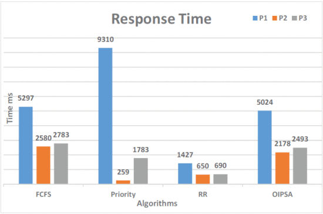

# 进程调度

## 多级反馈队列
  多级反馈队列（Multilevel Feedback Queue Scheduling）是一种基于反馈的调度算法。它使用多个调度队列，每种队列对应一种优先级，只有高优先级的任务执行完成才会执行更低优先级的任务。每个队列内部可以使用一种调度算法，如轮转调度，每次给一个任务一定的时间片，若进程耗尽时间片仍未执行完成则会进入更低优先级的队列。
  
  ## 智能进程调度
  智能进程调度（Intelligent Process Scheduling）是利用人工智能技术进行进程调度的方法。它运用机器学习和数据分析技术，通过对过去大量运行数据的分析，尝试预测进程的行为模式，并作出相应调度。相比传统调度算法，它更能适应不同工作环境，可以最大限度提高系统的资源利用率并减小响应时间。目前，该项技术仍在研究验证当中。

  我们在讨论中探讨了实现智能进程调度的可行性，参考了论文（[Organization Based Intelligent Process Scheduling Algorithm](https://ieeexplore.ieee.org/abstract/document/7313978)），得出的结论是在较小的规模内，采用智能进程调度得到的优化并不明显。

  

  *论文中与传统算法响应时间的比较*

  