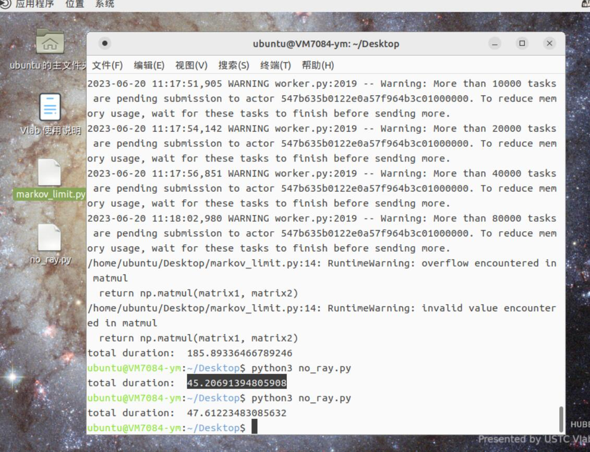
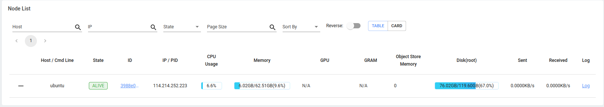
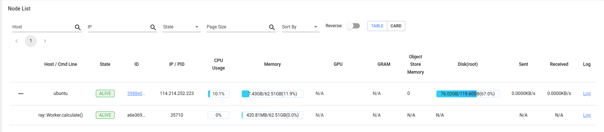
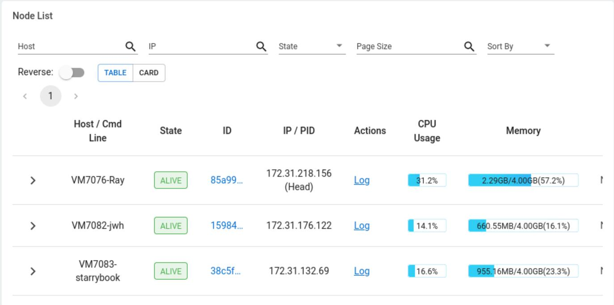

# OSH-2023 Phoneix-Flames Lab4实验报告

## 测试任务选定

本次选择的测试任务为转移概率矩阵的近似极限分布。

## 性能指标列表

* 吞吐量（Throughput）：指系统在单位时间内能够处理的请求或者任务数量，通常用每秒处理请求数（Requests per Second，RPS）或者每秒完成任务数（Tasks per Second，TPS）来衡量。

* 延迟（Latency）：指系统处理请求或者任务所需的时间，通常用平均响应时间（Average Response Time）或者百分位响应时间（Percentile Response Time）来衡量。
* 资源利用率（Resource Utilization）：指系统在运行过程中所使用的资源占总资源的比例，例如 CPU 使用率、内存使用率等。
* 可靠性（Reliability）：指系统在长时间运行中的稳定性和可靠性，通常用错误率（Error Rate）或者故障率（Failure Rate）来衡量。
* 扩展性（Scalability）：指系统在处理更多请求或者任务时的能力，通常用负载测试（Load Testing）或者压力测试（Stress Testing）来衡量。

## 单机版部署及性能测试

#### 1、Ray的安装

##### 1、安装python:

```shell
sudo apt-get install python
```

##### 2、安装pip：

```shell
curl https://bootstrap.pypa.io/get-pip.py -o get-pip.py
sudo python3 get-pip.py
```

##### 3、更新：

```shell
sudo apt update
```

##### 4、安装ray：

```shell
pip install -U ray
pip install 'ray[default]'
```

#### 2、测试过程

##### 1、创建head结点

使用命令：

```shell
ray start --head
```

创建节点

##### 2、运行测试程序

例如测试程序命名为test.py且位于当前工作目录下，则运行如下命令来启动运行程序：

```
python test.py
```

##### 3、查看结果

运行创建节点命令之后，会出现如下内容:

```
To monitor and debug Ray, view the dashboard at 
    127.0.0.1:8265
```

在浏览器中输入该ip地址，即可打开*Dashboard*查看运行结果

##### 4、退出

输入命令：

```shell
ray stop
```

退出程序

#### 3、用python编写的ray部署测试代码

```python
import ray
import time
import sys
import numpy as np

ray.init()

matrix_size: int = 10    # 10 * 10 matrix
matrix_mul_times: int = 10000000
if len(sys.argv) < 1:
    pc_num: int = 10    # default value = 10
else:
    pc_num: int = int(sys.argv[1])
node_task_num: int = matrix_mul_times // pc_num


def matrix_mul(matrix1, matrix2):
    return np.matmul(matrix1, matrix2)


@ray.remote
class Worker(object):
    def __init__(self):
        self.size = matrix_size
        self.matrix0 = self.matrix_init2()
        self.res = self.matrix0.copy()
        self.all_times = matrix_mul_times

    def matrix_init2(self):
        # 每行均为正数浮点随机数，单行和为1（归一化）
        matrix = np.random.random((matrix_size, matrix_size))
        for row in range(self.size):
            total = sum(matrix[row])
            for item in matrix[row]:
                item /= total
        # print("Now we have a matrix\n", matrix)
        return matrix

    # 转移矩阵的极限分布
    # 计算若干个矩阵的相乘
    def calculate(self, times):
        # print("I start doing my work.")
        cur_time = time.time()
        task_res = self.matrix0.copy()
        for k in range(times-1):
            task_res = matrix_mul(self.res, self.matrix0)
        # print("I have finished my work, duration: ", time.time() - cur_time)
        return task_res


if __name__ == '__main__':
    cur_time=time.time()
    worker = Worker.remote()
    temps=[]
    for i in range(pc_num):
        temp = worker.calculate.remote(node_task_num)
        temps.append(temp)

    result_list = ray.get(temps)

    result = result_list[0]
    for m in result_list:
        result = matrix_mul(result, m)
    # print("final matrix: \n", result)
    print("total duration: ", time.time() - cur_time)
```

#### 4、初步测试（使用不含ray的同规格任务测试）

文件：`no_ray.py`

**单机参数**

USTC vlab虚拟机的标准配置。

##### 运行结果




#### 5、Ray单机版分析、测试、优化

##### 单机参数

```
(ray) tern@ubuntu:~/Documents/codes/python-codes/trial$ cat /proc/version
Linux version 5.19.0-43-generic (buildd@lcy02-amd64-028) (x86_64-linux-gnu-gcc (Ubuntu 11.3.0-1ubuntu1~22.04.1) 11.3.0, GNU ld (GNU Binutils for Ubuntu) 2.38) #44~22.04.1-Ubuntu SMP PREEMPT_DYNAMIC Mon May 22 13:39:36 UTC 2

(ray) tern@ubuntu:~/Documents/codes/python-codes/trial$ cat /proc/cpuinfo | grep "cpu cores" | uniq
cpu cores	: 14
```


##### 部署与运行过程（精简）

**程序参数**

```
matrix_size: int = 10    # 10 * 10 matrix
matrix_mul_times: int = 10000000
if len(sys.argv) < 1:
    pc_num: int = 10    # default value = 10
else:
    pc_num: int = int(sys.argv[1])
```

**部署与运行（simplified，详见rec.md）**

```bash
tern@ubuntu:~/Documents/codes/python-codes/trial$ conda init bash
modified      /home/tern/.bashrc

tern@ubuntu:~/Documents/codes/python-codes/trial$ source ~/.bashrc
(base) tern@ubuntu:~/Documents/codes/python-codes/trial$ conda activate ray
(ray) tern@ubuntu:~/Documents/codes/python-codes/trial$ ray start --head
    
(ray) tern@ubuntu:~/Documents/codes/python-codes/trial$ python markov_new.py 100000
2023-06-20 11:29:11,978	INFO worker.py:1342 -- Connecting to existing Ray cluster at address: 114.214.252.223:6379...
total duration:  27.68019461631775

(ray) tern@ubuntu:~/Documents/codes/python-codes/trial$ python markov_new.py 10000
2023-06-20 11:29:56,011	INFO worker.py:1342 -- Connecting to existing Ray cluster at address: 114.214.252.223:6379...
total duration:  11.307637929916382

(ray) tern@ubuntu:~/Documents/codes/python-codes/trial$ python markov_new.py 10
2023-06-20 11:30:27,501	INFO worker.py:1342 -- Connecting to existing Ray cluster at address: 114.214.252.223:6379...
total duration:  9.69461703300476

(ray) tern@ubuntu:~/Documents/codes/python-codes/trial$ python markov_new.py 1
2023-06-20 11:30:51,152	INFO worker.py:1342 -- Connecting to existing Ray cluster at address: 114.214.252.223:6379...
total duration:  9.28380298614502
```


**Dashboard**






| 任务分配数 | 100000 | 10000 | 10   | 1    |
| ---------- | ------ | ----- | ---- | ---- |
| 测试时间   | 27.68  | 11.31 | 9.70 | 9.28 |


可见任务数增大时，时间开销大量增大。这是由于**进程间通讯**耗费了大量的时间。

最初任务数为100000,运行效果很差，后来将只任务切分为10份，性能优化了`185%`以上。


## 分布式部署及性能测试（基于docker）

#### 1、准备结点：头节点和工作节点

##### 1、安装OpenSSH Server （Linux Ubuntu）

输入如下命令在ubuntu上安装和配置OpenSSH Server：

```shell
sudo apt update
sudo apt install openssh-server
```

以下命令用于查看是否安装成功:

```shell
sudo systemctl status ssh
```

（正确安装可以看到active）

使用防火墙（即 ufw）打开 SSH 22/TCP 端口

```shell
sudo systemctl status ssh
```

检查端口22是否正确打开

```shell
sudo ufw status
```

(正确打开可以看到ALLOW)

##### 2、安装和配置Docker(Linux Ubuntu)

安装Docker软件

```shell
sudo apt update
sudo apt install docker.io
```

将用户添加到docker组

```shell
sudo usermod -aG docker $USER
```

验证Docker安装

```
docker --version
```

(正确安装后可以看到Docker的版本)

拉取并运行"hello-world"docker镜像

```
docker run hello-world
```

#### 2、准备客户端工作站

##### 1、安装Docker

由于结点使用相同的docker镜像可以更好的使用Ray进行工作，因此需要在客户机上也安装Docker。

编辑/etc/wsl.conf文件:

```shell
sudo nano /etc/wsl.conf
```

添加以下行:

```shell
[boot]
systemd=true
```

使用`CTRL+O`保存并使用`CTRL+X`来退出。

安装Docker软件:

```shell
sudo apt update
sudo apt install docker.io
```

将用户添加到docker群组

```shell
sudo usermod -aG docker $USER
```

验证Docker的安装

```shell
docker --version
```

(正确安装可以看到Docker的版本)

##### 2、运行Ray Docker镜像

拉取Ray docker镜像:

```shell
docker pull rayproject/ray-ml:latest-gpu
```

运行Ray docker容器：

```shell
docker run -i -t rayproject/ray-ml
```

获取python版本：

```shell
python --version
```

获取Ray python包版本：

首先输入如下命令进入python 解释器:

```shell
python
```

然后在python解释器中键入以下python脚本：

```python
import ray
print(ray.__version__)
```

此时输出ray的版本，然后退出python解释器，输入命令:

```python
quit()
```

最后退出docker容器:

```shell
exit
```

##### 3、设置SSH客户端

要部署 Ray 集群，需要使用 ssh-keygen 为 SSH 创建新的身份验证密钥对，以自动登录、单点登录和验证主机。创建密钥后，需要使用 ssh-copy-id 将公钥复制到 Ray 集群中的每个节点。

为SSH创建新的身份验证密钥对：

```shell
ssh-keygen
```

使用`ssh-copy-id`将公钥复制到每个节点。以一个头结点和三个工作节点为例，命令如下：

```shell
ssh-copy-id -i ~ /.ssh/i d_rsa. pub sungkim@ 192.168 .1 .101
ssh-copy-id -i ~ /.ssh/i d_rsa. pub sungkim@ 192.168 .1 .102
ssh-copy-id -i ~ /.ssh/i d_rsa. pub sungkim@ 192.168 .1 .103
ssh-copy-id -i ~ /.ssh/i d_rsa. pub sungkim@ 192.168 .1 .104
```


##### 4、安装和配置Miniconda

我们将安装和配置**Miniconda**以部署Ray集群。

Miniconda下载地址：[Miniconda下载]([https://www.anaconda.com/products/distribution#linux](https://docs.conda.io/en/latest/miniconda.html))

安装Miniconda：

```shell
bash ~/Downloads/Miniconda3-py310_22.11.1-1-Linux-x86_64.sh
```

安装完成之后，需要为Ray创建一个conda环境:

```shell
conda create --name ray python=3.7.13
```

接下来激活"Ray"环境:

```shell
conda activate ray
```

安装Ray python包:

```shell
pip install "ray[default]"==2.1.0
```

#### 3、使用Ray Up部署Ray集群

##### 1、下载YAML文件

```shell
wget https://raw.githubusercontent.com/ray-project/ray/master/python/ray/autoscaler/local/example-full.yaml _ _ _
```

##### 2、修改并重命名example-full.yaml文件

修改YAML文件的以下部分(黑色表示)：

```yaml
provider: 
    type:  local 
    head_ip:  YOUR_HEAD_NODE_HOSTNAME # 如果你需要从 Ray 集群网络外部运行 `ray up`，你可能需要为头节点提供一个公共 ip #（例如集群在 AWS VPC 中，你're starting ray from your laptop) # 这在使用云 VM 调试本地节点提供程序时很有用。# external_head_ip: YOUR_HEAD_PUBLIC_IP worker_ips: [ WORKER_NODE_1_HOSTNAME , WORKER_NODE_2_HOSTNAME , ... ] # 在 prem 上运行自动集群管理时可选。如果您使用协调服务器，
    
    
    
    
    
    
    # 然后你可以在同一组机器上启动多个自动缩放集群，协调器
    # 将根据需要将各个节点分配给集群。
    # coordinator_address: "<主机>:<端口>"
```

- head_ip：将成为头节点的计算机的 IP 地址（例如，192.1.168.101）。

- worker_ips：将成为工作节点的计算机的 IP 地址（例如，[192.168.1.102、192.168.1.103、192.168.1.104]）。

修改YAML文件的以下部分（黑色表示）：

```YAML
# Ray 如何对新启动的节点进行身份验证。
auth: 
    ssh_user:  YOUR_USERNAME 
    # 如果以下机器不需要私钥来通过 SSH 访问 Ray 
    # 集群，您可以注释掉 `ssh_private_key`：
    # (1) 执行 `ray up` 的机器。
    # (2) Ray集群的头节点。
    # 
    # 运行ray up的机器执行SSH命令设置Ray头节点。Ray 头节点随后
    执行 SSH 命令来设置 Ray 工作节点。当您运行 ray up 时，位于 ray up 
    # 机器上的 ssh 凭证被复制到头节点——在内部，ssh 密钥被添加到文件挂载列表中以 rsync 到头节点。
    # ssh_private_key: ~/.ssh/id_rsa
```

- ssh_user：将用于登录头节点计算机和工作节点计算机的用户名（例如，sungkim）。

修改YAML文件的以下部分（黑色表示）：

```yaml
# 除了头 # 节点外，要启动的最小工作节点数
。这个数字应该 >= 0。
# 通常，min_workers == max_workers == len(worker_ips)。
# 该字段是可选的。
min_workers: TYPICALLY_THE_NUMBER_OF_WORKER_IPS 

# 除头节点外要启动的最大工作节点数。
# 这优先于 min_workers。
# 通常，min_workers == max_workers == len(worker_ips)。
# 该字段是可选的。
max_workers: TYPICALLY_THE_NUMBER_OF_WORKER_IPS 
# 手动管理集群的默认行为是
#min_workers == max_workers == len(worker_ips), 
# 这意味着 Ray 在集群的所有可用节点上启动。
# 对于自动管理的集群，需要max_workers，min_workers默认为0。
```

- min_workers：worker_ips中IP地址的个数或3个。
- max_workers：worker_ips中IP地址的个数或3个。

保存更改并将文件重命名为“default-full.yaml”，因为集群名称是“default”。

##### 3、激活Ray Conda环境

运行以下命令以激活conda环境：

```shell
conda activate ray
```

##### 4、运行"ray up"

最后使用如下命令来部署Ray集群：

```shell
ray up default-full.yaml
```

使用如下命令来检查Ray集群的状态：

```shell
ray exec default-full.yaml 'ray status'
```

使用如下命令启动dashboard：

```shell
ray dashboard default-full.yaml
```

在浏览器中输入以下地址以打开**Ray Dashboard**

```shell
http://127.0.0.1:8265
```

使用一个microbenchmark来确保Ray集群按预期的工作：

```shell
ray exec default-full.yaml 'ray microbenchmark'
```

#### 4、验证Ray集群部署

将使用本地 docker 容器“rayproject/ray-ml”在 Ray 集群上工作和开发。

使用下述命令运行docker容器：

```shell
docker run -i -t -v 'your project directory':'/home/ray/projects' -w '/home/ray/projects' rayproject/ray-ml
```

或者使用实际的目录名称：

```shell
docker run -i -t -v '/home/sungkim/projects/ray' : '/home/ray/projects' -w '/home/ray/projects' rayproject/ray-ml
```

启动 Visual Studio Code 并将其附加到正在运行的 Docker 容器。安装 Jupyter/Python 扩展，然后创建一个新的 Jupypter notebook。

在 Visual Studio Code 中，在本地工作站上安装 python 包，然后将相同的 requirements.txt 传递给 Ray 集群。

```python
%%writefile requirements.txt

requests==2.28.0
```

```python
%pip install -r requirements.txt
```

接下来连接到Ray集群（初始化）：

```python
import os
os.environ['RAY_ADDRESS'] = 'ray://192.168.4.87:10001'
```

```python
import ray

if ray.is_initialized():
    ray.shutdown()

# Initialize the Ray cluster here
ray.init(
  address='auto', 
  logging_level='FATAL', 
  runtime_env={
    'working_dir':'/home/ray/projects', 
    'pip':['requirements.txt'], 
    'env_vars':{'RAY_SCHEDULER_EVENTS': '0'},
    'excludes': ['/home/ray/projects/.vscode-server/*']
  }
)
```

更多的ray.init()的信息请查阅：[Ray](https://docs.ray.io/en/latest/ray-core/package-ref.html )

最后，提交要在Ray集群上执行的代码片段：

```python
#（代码片段等待你们的加入）
```

使用`ray down`来关闭Ray集群：

```shell
ray down default-full.yaml
```

需要注意的是，关闭了Ray集群并没有关闭Ray容器，需要手动关闭Ray容器。

#### 5、分布式部署的性能测试

**多机配置**

三台虚拟机，USTC Vlab的标准配置。


**Dashboard**




#### 6、分布式部署的性能分析、优化

初始pc_num=100000，单位秒(s)，pc_num为任务拆分数

| 任务分配数：pc_num     | pc_num=100000            | pc_num=100        | pc_num = 30       | pc_num=12         |
| ---------------------- | ------------------------ | ----------------- | ----------------- | ----------------- |
| 无Ray                  | 45.20691394805908(+/-2s) | 同                | 同                | 同                |
| 单机版ray              | 185.89336466789246       | 45.6342716217041  | 48.51240634918213 | 46.83416128158569 |
| 多机ray集群（3个结点） | 171.68697834014893       | 50.97406363487244 | 43.56711173057556 | 49.56426119804382 |

任务规模在100000时，多机部署相对于单机部署有百分之十五的性能提升。

这里单机版我们得到了与此前在另一台计算机上运行相似的结果，单机调参优化最高达到`307%`  。

多机版本不同的是，在任务柴分数进一步减小，从30减少到12时性能出现了百分之四十的回降，这是由于计算资源没有得到充分利用，这一点抵消了进程间通讯的开销。可以想见，如果任务规模大幅扩大，则多机的性能会较大幅度的优于单机。多机调参优化最高达到`294%`。

